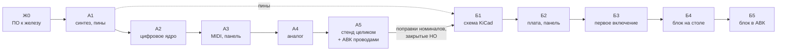
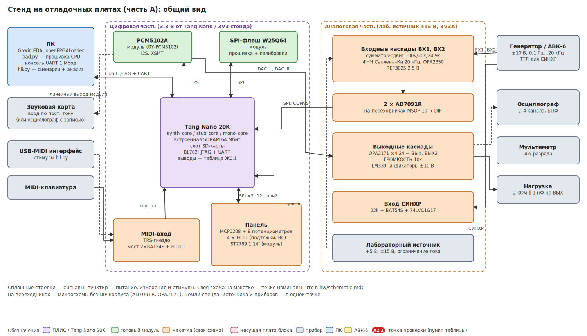
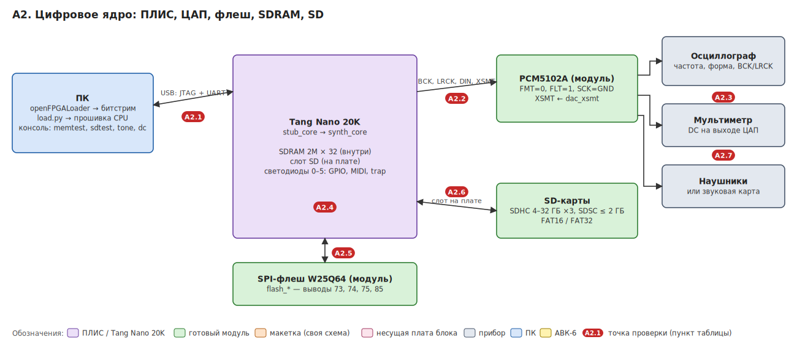
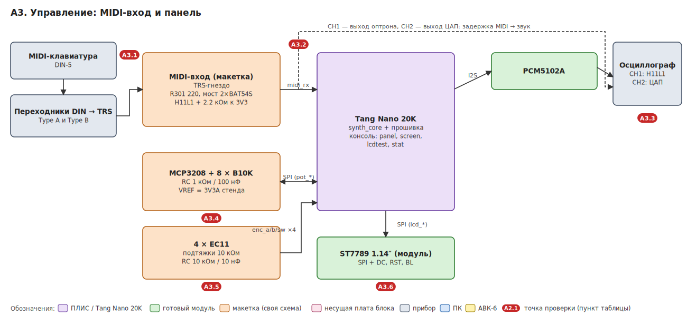
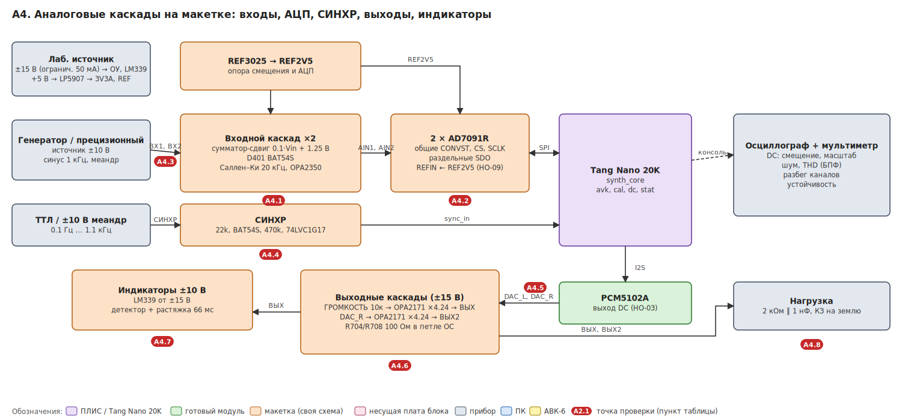
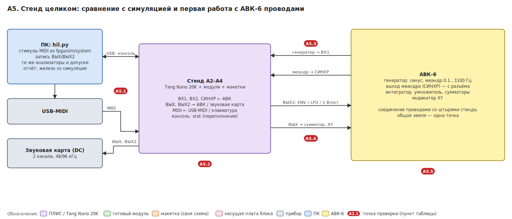
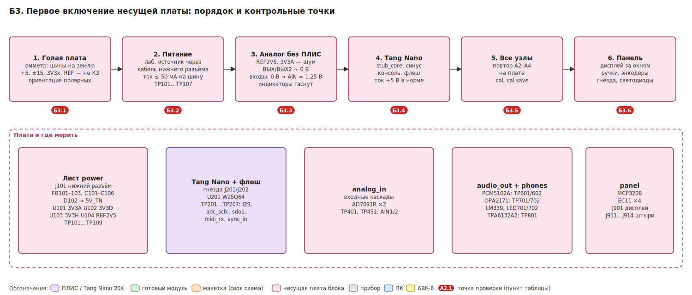
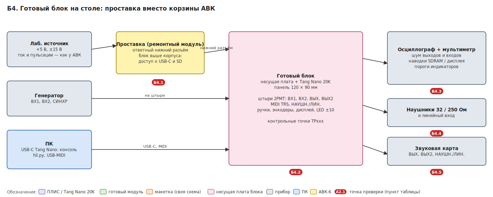
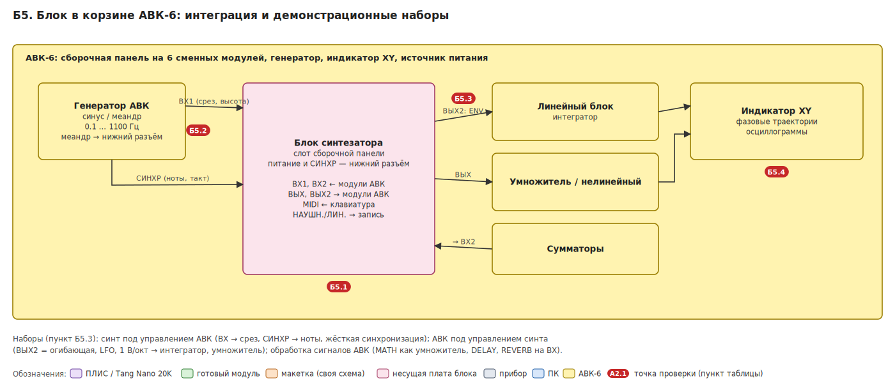

# План: FPGA-синтезатор для АВК-6 — железо

ТЗ: [`trs.md`](trs.md) · требования к схеме: [`hw-requirements.md`](hw-requirements.md) · схема по узлам:
[`hw/schematic.md`](../../hw/schematic.md) · проект KiCad: [`hw/kicad`](../../hw/kicad/README.md) · эскиз панели:
[`panel-sketch.svg`](panel-sketch.svg) · сделанное в симуляции: [`done-sim.md`](done-sim.md).

## Где мы сейчас

| Часть | Что | Статус |
|---|---|---|
| Этапы 0–9 | RTL, прошивка, Python-модели, тесты, CI: голоса, фильтр, огибающие, модуляция, связь с АВК, эффекты, панель, пресеты | **готово в симуляции**, журнал и решения — [`done-sim.md`](done-sim.md) |
| Документы железа | ТЗ, требования к узлам (`Т-xx`), схема по узлам, рисунки узлов, проект KiCad (сгенерирован, цепи сверены) | черновик, уточняется по итогам части А |
| **Ж0** | подготовка ПО к работе с железом: команды запуска, калибровки, счётчики, ОЗУ 64 КБ, скрипты стенда | **следующий шаг** (агент, без железа) |
| **Часть А** | стенд на отладочных платах: Tang Nano 20K, готовые модули, свои узлы на макетках | впереди |
| **Часть Б** | готовый блок: несущая плата, панель, работа в корзине АВК-6 | впереди |

Часть А снимает все риски, которые дорого исправлять на плате: распиновку, тайминг ПЛИС, DC-тракт ЦАП, SDRAM,
номиналы аналоговых узлов, уровни СИНХР. Часть Б начинается, когда стенд целиком работает и цифры записаны.
Схему (Б1) можно доводить параллельно с А2–А5: распиновка известна после А1.

## Как работаем

- **Кто.** Агент — всё без железа: код, тесты, документы, разбор присланных отчётов Gowin, осциллограмм, записей
  и логов консоли. Автор — всё, что требует платы, приборов, Gowin EDA и АВК.
- **Ошибка на железе** сначала воспроизводится в симуляции (тест в `fpga/sim/` или хост-тест в `sw/test/`),
  потом исправляется; тест остаётся в CI. Если в симуляции не воспроизводится — уточняется модель периферии
  (`fpga/sim/tb/soc_models.h`).
- **Каждая проверка — одна команда консоли** (Ж0.2) или один сценарий `hil.py` (Ж0.6), без пересборки битстрима.
- **Числа с железа** (пороги, смещения, фазы, калибровки, токи) записываются в раздел
  [«Результаты измерений»](#результаты-измерений) этого плана и переносятся в `hw-requirements.md`; изменения
  номиналов — в `hw/schematic.md` и генератор схемы KiCad.
- **Безопасность стенда.** Лабораторный источник с ограничением тока (50 мА на шину ±15 В при первом включении),
  одна точка соединения земель стенда, источника и приборов; ±15 В не подавать на макетку цифровой части.

На схемах ниже красные метки — точки проверки, номер совпадает с пунктом таблицы этапа.

## Оборудование

| Приборы | Модули и детали для стенда |
|---|---|
| осциллограф 2–4 канала с БПФ | Tang Nano 20K (и 9K для сравнения, по желанию) |
| мультиметр 4½ разряда | модуль PCM5102A (GY-PCM5102 или аналог) |
| лабораторный источник +5 В, ±15 В с ограничением тока | модуль SPI-флеш W25Q64, модуль дисплея ST7789 1.14″ |
| генератор сигналов ±10 В, 0.1 Гц…20 кГц, меандр ТТЛ (или АВК-6) | MCP3208 (DIP), 8 × B10K, 4 × EC11 с кнопкой |
| звуковая карта с входом по постоянному току (или осциллограф с записью) | H11L1 (DIP), TRS-гнездо, переходники DIN → TRS Type A и B, BAT54S |
| USB-MIDI интерфейс, MIDI-клавиатура | 2 × AD7091R + переходники MSOP-10 → DIP, REF3025, LP5907 / модуль LDO 3.3 В |
| наушники 32 Ом и 250 Ом | OPA2350 (или TLV9062), OPA2171 + переходник SOIC-8, LM339 (DIP), 74LVC1G17 + переходник |
| нагрузка 2 кОм ‖ 1 нФ, SD-карты: SDHC 4–32 ГБ × 3, SDSC ≤ 2 ГБ | резисторы 0.1 % (100k, 20.0k, 24.9k, 10.0k, 32.4k), C0G 1.1 нФ / 560 пФ, макетные платы |

## Ж0. Подготовка ПО к железу (агент, без железа)

| # | Задача | Зачем |
|---|---|---|
| Ж0.1 | **Единая таблица пинов** (`fpga/boards/pins.csv` или `.py`) → генерация обоих `.cst`, проверка в CI, что каждый порт top назначен ровно один раз | распиновка поменяется (А1, Б1); руками два `.cst` разъедутся |
| Ж0.2 | **Команды запуска железа** в консоли: `dc <out> <мВ>` (постоянное напряжение на ВЫХ/ВЫХ2), `tone <Гц>` (синус без MIDI), `memtest [слов]` (бегущие 0/1, адрес-в-данные, счёт ошибок), `lcdtest` (заливки, сетка, все символы), `sdtest` (скорость, проверка записи) | каждая проверка А2–А4 — одной командой |
| Ж0.3 | **Калибровка выходов** (смещение и масштаб ВЫХ/ВЫХ2) и **сохранение всех калибровок** в сектор флеша, загрузка при старте, `cal save`, `cal show` | калибровка входов теряется при перезагрузке, выходов нет вовсе |
| Ж0.4 | **Счётчики переполнения**: движок голосов или шина слотов не успели до `audio_tick`; переполнение FIFO UART/MIDI; команда `stat` | на железе иначе не узнать, что отсчёты теряются |
| Ж0.5 | **Память прошивки**: сейчас 30.7 КБ из 32 КБ. Сборка 20K с ОЗУ 64 КБ (`RAM_BYTES`, свой `link.ld`, размер из SYSINFO), проверка размера для каждой платы в CI; решить, что урезать в сборке 9K | без этого Ж0.2–Ж0.4 не поместятся |
| Ж0.6 | **Скрипты стенда** `sw/tools/hil.py`: проиграть стимулы MIDI из `fpga/sim/system` через USB-MIDI, записать ВЫХ/ВЫХ2 звуковой картой, прогнать теми же анализаторами и допусками, отчёт «железо vs симуляция» | А5 и Б4 сравнивают железо с симуляцией по одним критериям |
| Ж0.7 | **Карта подключений стенда** из таблицы Ж0.1: какой вывод гребёнки Tang Nano к какому выводу модуля/макетки, с цветами проводов; печатный лист для сборки | стенд из ~60 проводов без карты собирается с ошибками |
| ~~Ж0.8~~ | ~~Сверить требования с RTL: АЦП входов — 5 выводов, SD — встроенный слот 20K~~ | **Сделано:** Т-3.4 исправлена |

**Готово, когда:** всё в CI, `make test` зелёный, прошивка для 9K и 20K помещается с запасом ≥ 1 КБ,
карта подключений стенда распечатана.

---

## Часть А. Стенд на отладочных платах

Цифровая часть — Tang Nano 20K и готовые модули на проводах. Свои узлы — на макетных платах с теми же номиналами,
что в `hw/schematic.md`. Микросхемы без DIP-корпуса — на переходниках. Аналоговая часть питается от лабораторного
источника (±15 В на ОУ и компараторы, 3V3A и REF2V5 — от своих LDO и опоры на макетке, как на будущей плате).
Усилитель наушников TPA6132A2 (корпус WQFN) на стенд не ставится: слушаем через гнездо модуля PCM5102A,
наушники проверяются на плате (Б4).

### А1. Синтез и распиновка

Автор запускает Gowin EDA, агент разбирает отчёты.

| # | Что | Как | Готово, когда |
|---|---|---|---|
| А1.1 | Сборка битстримов | `make bitstream-20k`, `make bitstream-9k` (CORE=synth); отчёты утилизации (LUT, регистры, BSRAM, DSP) и тайминга (Fmax, худшие пути) — агенту | без ошибок; цифры — в «Оценку ресурсов» |
| А1.2 | **HO-01:** распиновка Tang Nano 20K | свободные GPIO, банки 3.3 В, что занято SD-слотом, светодиодами, HDMI, BL702; заполнить таблицу Ж0.1, сгенерировать `.cst` | все порты top назначены; карта подключений стенда (Ж0.7) обновлена |
| А1.3 | Тайминг 99 МГц | если не сходится (вероятные пути: умножитель голосов, аккумулятор `fx_bus`, делитель `slot_math`, адреса слотов) — агент вставляет регистры; модель не меняется, тесты бит-в-бит зелёные. Запасной вариант — ниже частота PLL (fs и таблица нот пересчитываются сами) | положительный запас по всем путям |
| А1.4 | Ресурсы | при нехватке на 20K — меньше `NUM_VOICES` или слотов (параметры) | конфигурация записана |

### А2. Цифровое ядро: ПЛИС, ЦАП, флеш, SDRAM, SD

Собрать: Tang Nano 20K, модуль PCM5102A на I2S + XSMT, модуль SPI-флеш на выводах 73/74/75/85, SD-карта в слоте платы.
Сначала `stub_core` (синус без процессора), потом `synth_core` с прошивкой.

| # | Что проверяется | Где и как | Прибор | Критерий |
|---|---|---|---|---|
| А2.1 | Загрузка и консоль | `openFPGALoader` → битстрим; `sw/tools/load.py` → прошивка в ОЗУ; консоль 1 Мбод | ПК | `READY`, команды отвечают, светодиод 0 мигает |
| А2.2 | I2S и тактирование | BCK, LRCK, DIN на выводах модуля; `stub_core` → синус 440 Гц | осциллограф | BCK = 3.094 МГц, LRCK = 48.34 кГц; синус 440 Гц ±0.5 %, чистый |
| А2.3 | **HO-03:** ЦАП по постоянному току | `dc 0`, `dc +5000`, `dc −5000` на выходе модуля; авто-mute на нулевых данных; проверить, нет ли на модуле разделительных конденсаторов (снять, если есть) | мультиметр | смещение ≤ 5 мВ, линейность по DC; решение по XSMT записано в Т-8.5 |
| А2.4 | **HO-07:** SDRAM | `memtest` по всем 2M слов при разных фазах `O_sdram_clk` и `RD_EXTRA` | консоль | 0 ошибок за ≥ 10 проходов с запасом по фазе; значения — в `top_synth.sv` |
| А2.5 | SPI-флеш | `load.py --flash`, перезапуск с флеша; `cal save` → перезапуск → `cal show` | консоль | старт с флеша без ПК, калибровки переживают сброс |
| А2.6 | SD-карта | `sd`, `ls`, `save`/`load`, `sdtest`, `fwupdate` на всех картах из набора | консоль | все карты монтируются; несовместимые — в README |
| А2.7 | Синтезатор на слух | `note`/`off` из консоли, аккорд 32 голоса, эффекты DELAY/REVERB | наушники / звуковая карта | звук без щелчков; `stat` без переполнений |

**Готово, когда:** все пункты в допуске, HO-03 и HO-07 закрыты, результаты записаны.

### А3. Управление: MIDI-вход и панель

Добавить к стенду А2: MIDI-вход на макетке (TRS-гнездо, R301, мост 2×BAT54S, H11L1, подтяжка 2.2 кОм к 3V3),
MCP3208 с 8 потенциометрами (VREF и верх потенциометров — от 3V3A), 4 энкодера с подтяжками и RC, модуль дисплея.

| # | Что проверяется | Где и как | Прибор | Критерий |
|---|---|---|---|---|
| А3.1 | MIDI-кабели | клавиатура через переходник DIN → TRS **Type A** и **Type B**; все ноты, velocity, pitch bend, mod wheel, sustain | слух, консоль | обе разводки работают одинаково (мост) |
| А3.2 | Выход оптрона | вывод 4 H11L1: уровни, фронты, покой | осциллограф | 0 / 3.3 В, фронты ≤ 2 мкс, покой — «1» |
| А3.3 | Задержка MIDI → звук | CH1 — выход оптрона, CH2 — выход ЦАП; одиночная нота; то же при перерисовке меню | осциллограф | ≤ 3 мс в обоих случаях |
| А3.4 | Потенциометры | `panel`: каждый канал на весь ход; соответствие ручек каналам CH0…CH7 | консоль | 0…4095, дрожание ≤ ±3 МЗР, порядок как в прошивке |
| А3.5 | Энкодеры | `panel`: направление, шаг, кнопки; быстрое вращение | консоль | 1 шаг на щелчок, без пропусков и двойных шагов |
| А3.6 | Дисплей | `lcdtest`, затем меню: смещения 40/53, инверсия, ориентация, подсветка (`lcd_bl`) | глаз, фото | кадр совпадает со снимками симуляции `img/readme/lcd_*.png`; тип входа BLK модуля записан (Т-13.2) |

**Готово, когда:** звук настраивается с панели без ПК, MIDI работает с обоими типами кабелей.

### А4. Аналоговые каскады на макетке

Собрать на макетке узлы листов `analog_in`, `audio_out` и СИНХР по `hw/schematic.md` (номиналы 0.1 % — где указано).
Питание: ±15 В от источника — только выходные ОУ и LM339; 3V3A и REF2V5 — от LDO и REF3025 на макетке.

| # | Что проверяется | Где и как | Прибор | Критерий |
|---|---|---|---|---|
| А4.1 | Входной каскад по DC и АЧХ | узел сумматора и `AIN1/2` при Vin = −12.5 / 0 / +12.5 В; синус 1…200 кГц на ВХ | мультиметр, генератор, осциллограф | 0 / 1.25 / 2.5 В ±10 мВ; −3 дБ на 20 кГц ±10 %; ≤ −35 дБ на 172 кГц (Т-6.3) |
| А4.2 | АЦП и калибровка входов; **HO-09** | режим внешней опоры AD7091R; `avk` при 0 В и ±10 В; `cal 1 zero`, `cal 1 10000` (то же для 2); синус 1 кГц — шум, искажения; один сигнал на оба входа — разность | консоль, источник | после калибровки ≤ 10 мВ и 0.2 %; шум ≤ 1 мВ rms; разбег каналов ≤ 1 мкс; HO-09 закрыт |
| А4.3 | Перегрузка входа | ±15 В на ВХ 10 минут; затем снова А4.1 | мультиметр | АЦП не выходит за 0…3.3 В, нет защёлкивания и дрейфа (Т-6.2) |
| А4.4 | Вход СИНХР | меандр ТТЛ, ±5 В, ±10 В, ±15 В; 0.1 Гц…20 кГц; `avk` показывает частоту | осциллограф (до и после 74LVC1G17) | срабатывает на всех уровнях; частота ±0.1 %; пороги записаны |
| А4.5 | ЦАП → выходные каскады | `dc` на ВЫХ/ВЫХ2: −1 / 0 / +1 МЕ; калибровка выходов (Ж0.3); ГРОМКОСТЬ на максимуме | мультиметр | ±10.00 В ±20 мВ после калибровки; смещение до калибровки ≤ 20 мВ (Т-9.7) |
| А4.6 | Выходы: нагрузка и устойчивость | нагрузка 2 кОм ‖ 1 нФ; меандр 1 кГц — выбросы; шум при `dc 0`; синус 20 кГц; КЗ на землю 1 мин | осциллограф | нет звона и самовозбуждения; шум ≤ 200 мкВ rms; ФНЧ ≈ 49 кГц; КЗ без повреждений, нагрев OPA2171 записан (Т-9.4) |
| А4.7 | Индикаторы ±10 В | `dc` медленно через ±10 В; одиночный импульс 1 мс за порог | осциллограф, глаз | пороги ±10.02 ±0.3 В; светодиод горит ≥ 50 мс после импульса (Т-10) |
| А4.8 | Порядок включения | включение и выключение питания стенда при работающей схеме | осциллограф на ВЫХ | выбросы ≤ ±12.5 В, ЦАП молчит до готовности ПЛИС (Т-9.8) |

**Готово, когда:** все пункты в допуске; изменённые номиналы перенесены в `hw/schematic.md` и генератор KiCad.

### А5. Стенд целиком: сравнение с симуляцией и работа с АВК-6 проводами

| # | Что проверяется | Где и как | Критерий |
|---|---|---|---|
| А5.1 | Железо против симуляции | `hil.py` прогоняет сценарии `fpga/sim/system/test_*.py`: тот же MIDI, те же команды консоли, запись ВЫХ/ВЫХ2, те же анализаторы | высота нот, bend, вибрато — ±0.5 цента; огибающие, фильтр, резонанс — форма и времена как у модели; PolyBLEP — подавление зеркальных частот ≥ 12 дБ; задержка — ±1 отсчёт; хорус, флэнжер, реверберация — на слух и по спектрограмме |
| А5.2 | Нагрузка | 32 голоса + 6 слотов + меню + консоль, 10 минут; `stat` | ни одного переполнения |
| А5.3 | АВК → стенд | генератор АВК → ВХ1 (срез, высота); меандр АВК → СИНХР (**HO-02:** осциллограмма реального сигнала, уровни и фронты); ВХ1·ВХ2 в слоте MATH против умножителя АВК | модуляция без шума и скачков; HO-02 закрыт; MATH совпадает с умножителем АВК в пределах его точности |
| А5.4 | Стенд → АВК | ВЫХ2 = ENV, LFO, высота ноты 1 В/окт → интегратор и умножитель АВК; ВЫХ → сумматор и индикатор XY | 1 В/окт ±5 мВ на октаву после калибровки; ENV и GATE видны на индикаторе АВК |
| А5.5 | Земли и помехи | стенд подключён к АВК проводами: шум ВХ при `avk`, фон 50 Гц и пульсации питания АВК на ВЫХ | шум входов ≤ 1 мВ rms; если хуже — решение по заземлению записано в Т-2.x |

**Выход из части А — готово, когда:**
- HO-01, HO-02, HO-03, HO-07, HO-09 закрыты;
- все пункты А2–А5 в допуске, цифры в «Результатах измерений»;
- поправки номиналов и компонентов внесены в `hw-requirements.md`, `hw/schematic.md`, генератор KiCad;
- `.cst` 20K окончательный (из таблицы Ж0.1).

---

## Часть Б. Готовый блок

### Б1. Схема в KiCad: доводка и проверка

Проект `hw/kicad/` сгенерирован по `hw/schematic.md`, цепи сверены скриптом (`check.py`). После части А:

1. Агент вносит поправки А2–А5 в генератор и `schematic.md`, перегенерирует схему, прогоняет `check.py`, обновляет PDF.
2. Автор принимает схему в работу: ERC в KiCad, при желании перерисовывает узлы проводами. **С этого момента
   генератор не запускается** — источником правды становятся файлы KiCad (см. `hw/kicad/README.md`).
3. Агент проверяет PDF/netlist по чек-листу, замечания — в `hw/review.md`:

| Проверка | Требование |
|---|---|
| каждый пункт `Т-xx` реализован | `hw-requirements.md` |
| уровни на выводах ПЛИС ≤ 3.3 В при любом состоянии питания; последовательные резисторы и подтяжки | Т-1.4, Т-2.5, Т-3.x |
| номиналы входных фильтров, усиления выходов, порогов индикации — по результатам А4 | Т-6.3, Т-9.1, Т-10 |
| распиновка гребёнки Tang Nano = `.cst` (таблица Ж0.1) | Т-3.4 |
| развязка питания у каждой микросхемы; разделение 3V3A / 3V3D / 3V3H | Т-2.x |
| цепи совпадают со `schematic.md` (`check.py` по netlist автора) | — |

**Готово, когда:** ERC чистый, замечания `hw/review.md` закрыты или приняты автором с обоснованием.

### Б2. Плата и панель

| # | Что | Как проверяется | Готово, когда |
|---|---|---|---|
| Б2.1 | Разводка 120 × 90 мм: 4 слоя, аналоговая зона отдельно от Tang Nano и SDRAM, контрольные точки (Т-15) | DRC; агент сверяет по чек-листу Т-15 и расположение TP | DRC чистый |
| Б2.2 | **HO-05:** высоты — стойки, длина валов, дисплей за окном, Tang Nano с USB-C | 3D-модель платы + панели; проставка | всё помещается в корзину, USB-C доступен на проставке |
| Б2.3 | **HO-06:** нижний разъём — снять со штатного модуля, посадочное место | сверка с штатным модулем | распиновка в Т-14.1 |
| Б2.4 | Панель из `panel-sketch.svg` с реальными координатами | агент сверяет отверстия панели и элементы платы, штыри ВХ/ВЫХ — по сетке АВК (4 мм от края, 61 мм) | координаты совпадают |
| Б2.5 | Перечень элементов | экспорт BOM, сверка с `schematic.md` | плата и панель заказаны, детали куплены |

### Б3. Первое включение платы

Порядок — строго по шагам; каждый следующий — только после того, как предыдущий в допуске.

| # | Шаг | Где и как | Критерий |
|---|---|---|---|
| Б3.1 | Голая плата | омметр: каждая шина (+5V_IN, ±15V, 3V3A/D/H, REF2V5, 5V_TN) на GND; ориентация электролитов (C105 — «+» на GND), диодов, микросхем | нет КЗ; полярность верная |
| Б3.2 | Питание, без Tang Nano | лабораторный источник через кабель с ответной частью нижнего разъёма; ограничение 50 мА на шину; TP101…TP107 | шины в норме, токи покоя записаны |
| Б3.3 | Аналог без ПЛИС | REF2V5 и 3V3A — значение и шум; ВЫХ/ВЫХ2 при заглушённом ЦАП; ВХ = 0 В → TP401/TP451 = 1.25 В; индикаторы | REF2V5 = 2.500 В ±0.2 %; ВЫХ ≈ 0 В; AIN = 1.25 В ±10 мВ; светодиоды не горят |
| Б3.4 | Tang Nano | установить; `stub_core` → синус на TP601/602; консоль, загрузка с флеша | ток +5 В в норме, синус есть |
| Б3.5 | Все узлы | повтор А2–А4 на плате (те же команды и критерии); калибровка `cal`, `cal save` | все пункты в допуске |
| Б3.6 | Панель | плата с панелью на стойках: дисплей в окне, валы и гнёзда в отверстиях, светодиоды | механика сходится, всё работает с панели |

### Б4. Готовый блок на столе: проставка вместо корзины

Блок питается через проставку (ремонтный модуль) от лабораторного источника; USB-C Tang Nano и SD-карта доступны.

| # | Что проверяется | Где и как | Критерий |
|---|---|---|---|
| Б4.1 | Питание через нижний разъём | лабораторный источник → проставка → J101; пульсации на ±15 В как у АВК (до 1 В, по статье) | шины платы в норме при пульсациях; шум 3V3A не растёт |
| Б4.2 | Блок против симуляции | `hil.py`: все сценарии А5.1 на собранном блоке | те же допуски, что А5.1 |
| Б4.3 | Шумы и наводки | ВЫХ, ВЫХ2 при `dc 0`; ВХ при заземлённом входе; спектр — наводки от SDRAM, дисплея, I2S на аналоговые узлы | ВЫХ ≤ 200 мкВ rms, ВХ ≤ 1 мВ rms, нет линий выше −80 дБ МЕ |
| Б4.4 | Выход на наушники | TPA6132A2: наушники 32 Ом и 250 Ом; синус на полной громкости; моно-штекер TS (КЗ кольца); включение и выключение | ≥ 30 мВт на 32 Ом, ≥ 1 В rms на 300 Ом; КЗ без повреждений; щелчки ≤ 10 мВ (Т-9a) |
| Б4.5 | Линейный выход | НАУШН./ЛИН. в звуковую карту; DC на ВХ (сигнал АВК с постоянной составляющей) | нижняя граница ≤ 5 Гц, постоянной составляющей на выходе нет (Т-9a.4) |

### Б5. Блок в корзине АВК-6

| # | Что проверяется | Где и как | Критерий |
|---|---|---|---|
| Б5.1 | Блок в корзине | питание от АВК; токи по шинам; помехи по питанию АВК на ВЫХ и ВХ | блок работает; шумы как в Б4.3 |
| Б5.2 | СИНХР от АВК | меандр генератора АВК через нижний разъём; `avk` | частота = генератор АВК ±0.1 % во всём диапазоне 0.1…1100 Гц |
| Б5.3 | Демонстрационные наборы | синт под управлением АВК (ВХ → срез, СИНХР → ноты, жёсткая синхронизация); АВК под управлением синта (ВЫХ2 = огибающая, LFO, 1 В/окт → интегратор, умножитель); обработка сигналов АВК (MATH как умножитель, DELAY, REVERB на ВХ) | каждый набор: пресет на SD, фото набора, запись звука |
| Б5.4 | Калибровка по АВК и наблюдение | калибровка ВХ и ВЫХ по эталону ±10 В АВК, `cal save`; при ГРОМКОСТЬ = max передача ×1 (Т-9.2); осциллограммы на индикаторе XY | ±1 МЕ АВК = ±1.0 в цифре ±0.2 % |
| Б5.5 | Долгий прогон | несколько часов в корзине; `stat` | без зависаний и переполнений |

**Готово, когда:** блок работает в АВК, наборы записаны (звук + фото), README дополнен разделом «Работа с АВК».

---

## Результаты измерений

Заполняется по ходу частей А и Б; значения переносятся в `hw-requirements.md`.

| Пункт | Величина | Требование | Измерено | Дата |
|---|---|---|---|---|
| А1.1 | LUT / регистры / BSRAM / DSP (20K) | — | | |
| А1.3 | Fmax (20K) | ≥ 99 МГц | | |
| А2.2 | частота синуса 440 Гц | ±0.5 % | | |
| А2.3 | смещение ЦАП по DC | ≤ 5 мВ | | |
| А2.4 | фаза `O_sdram_clk`, `RD_EXTRA` | 0 ошибок | | |
| А3.3 | задержка MIDI → звук | ≤ 3 мс | | |
| А4.1 | −3 дБ входного фильтра / ослабление на 172 кГц | 20 кГц ±10 % / ≤ −35 дБ | | |
| А4.2 | погрешность ВХ после калибровки / шум / разбег | ≤ 10 мВ, 0.2 % / ≤ 1 мВ / ≤ 1 мкс | | |
| А4.4 | пороги СИНХР (VT+ / VT−) | — | | |
| А4.5 | смещение ВЫХ до калибровки | ≤ 20 мВ | | |
| А4.6 | шум ВЫХ / нагрев OPA2171 при КЗ | ≤ 200 мкВ rms / — | | |
| А4.7 | пороги индикаторов / растяжка | ±10.02 ±0.3 В / ≥ 50 мс | | |
| А5.3 | уровни СИНХР АВК (HO-02) | — | | |
| Б3.2 | токи покоя +5 / +15 / −15 | ≤ 500 / 30 / 30 мА | | |
| Б4.4 | мощность на 32 Ом / напряжение на 300 Ом | ≥ 30 мВт / ≥ 1 В rms | | |

## Оценка ресурсов (грубо, уточнить синтезом в А1)

| Блок | LUT | Умножители 18×18 | BSRAM |
|---|---|---|---|
| PicoRV32 + периферия | ~2.5K | 0–4 | 2–3 блока + код |
| Голосовой движок (32 голоса) | ~2–3K | 4–6 | 2–4 |
| SVF, огибающие, LFO | внутри движка | | |
| Слот MATH | ~0.5K | 1–2 | — |
| Слот DELAY + контроллер SDRAM | ~1K | 1 | 1 |
| REVERB | ~1K | 2 | 4–8 (или SDRAM) |
| **Итого** | **~8K** | **~15** | **~20** |

9K (8.6K LUT, 20 умножителей, 26 BSRAM): 16 голосов, 3 слота. 20K (20.7K LUT, 48 умножителей, 46 BSRAM): полная
конфигурация с запасом ~2×.

Схемы стендов генерируются `python3 .plans/fpga-synth/tools-gen-plan-diagrams.py` (SVG; PNG — через cairosvg).
