# АВК-6 «Музыкальная пауза»: FPGA-синтезатор и процессор эффектов

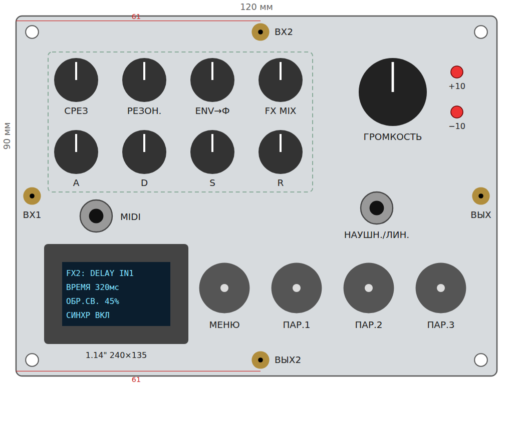

Сменный модуль для аналогового компьютера **АВК-6**: полифонический MIDI-синтезатор и процессор
эффектов на ПЛИС **Tang Nano 20K** (макет — Tang Nano 9K). Модуль стыкуется с АВК в обе стороны:
входы ВХ1/ВХ2 и СИНХР принимают напряжения АВК и управляют синтезатором и эффектами, а выходы
ВЫХ/ВЫХ2 отдают в АВК звук, огибающие, LFO, GATE или напряжение высоты ноты. Готовый звук
доступен и без АВК — на гнезде наушников / линейного выхода.

Весь звуковой тракт (голоса, фильтры, огибающие, модуляция, эффекты) — в RTL на ПЛИС; распределение
голосов, меню, пресеты — прошивка софт-процессора PicoRV32 внутри той же ПЛИС.

> **Состояние.** Этапы 0–9 плана реализованы и проверены в симуляции (Verilator, бит-в-бит против
> Python-моделей, CI на каждый коммит). Плата, распиновка и проверка на железе — впереди
> (см. [«Что ещё нужно проверить на железе»](#что-ещё-нужно-проверить-на-железе)).
> Предыдущий модуль серии — одноголосный конвертер **MIDI2AUX** на Arduino Nano: [docs/midi2aux.md](docs/midi2aux.md).

Все графики ниже построены по тем же моделям, с которыми бит-в-бит сверяется RTL
(`fpga/model/synthmodel`), а снимки экрана — по коду меню прошивки (`make readme-img`).
Машинная единица АВК (МЕ) = 10 В; входы и выходы — ±12.5 В по постоянному току.

## Содержание

- [Возможности](#возможности)
- [Как устроен](#как-устроен)
- [Аппаратная часть](#аппаратная-часть)
- [Панель](#панель)
- [Голос: генераторы](#голос-генераторы)
- [Фильтр](#фильтр)
- [Огибающие](#огибающие)
- [Модуляция: LFO, матрица, детектор](#модуляция-lfo-матрица-детектор)
- [Связь с АВК](#связь-с-авк)
- [Эффекты](#эффекты)
- [Меню: как пользоваться](#меню-как-пользоваться)
- [Пресеты, SD-карта, обновление прошивки](#пресеты-sd-карта-обновление-прошивки)
- [Консоль](#консоль)
- [Сборка и проверка](#сборка-и-проверка)
- [Что ещё нужно проверить на железе](#что-ещё-нужно-проверить-на-железе)

## Возможности

| | |
|---|---|
| Полифония | 32 голоса на 20K, 16 на 9K (параметр `NUM_VOICES`), MIDI omni, velocity, pitch bend, mod wheel, sustain |
| Голос | 2 генератора (пила, меандр/PWM, треугольник, синус) + шум, расстройка, PolyBLEP, жёсткая синхронизация от СИНХР |
| Фильтр | резонансный ФНЧ / полосовой / ФВЧ 12 дБ/окт на голос, срез от огибающей, velocity и модуляции |
| Огибающие | две ADSR на голос: громкость и срез фильтра |
| Модуляция | 2 LFO (6 форм, сброс фазы от СИНХР), матрица 8 маршрутов «источник × глубина × через» на высоту, срез, громкость, скважность; следящий детектор огибающей входа |
| Связь с АВК | ВХ1/ВХ2 — 12-битные АЦП на 4·fs с цифровым фильтром; СИНХР — период, запуск нот, такт LFO и задержки; ВЫХ2 — любой сигнал шины или напряжение высоты ноты 1 В/окт |
| Эффекты | слоты на общей шине сигналов: MATH (как математические блоки АВК), DELAY ×2, CHORUS/FLANGER, REVERB; мягкий ограничитель на выходах |
| Управление | 8 ручек, 4 энкодера с кнопками, дисплей 240×135, консоль по USB-UART |
| Выходы | ВЫХ, ВЫХ2 — ±12.5 В по постоянному току в АВК; НАУШН./ЛИН. — наушники 16–600 Ом или линейный вход |
| Хранение | пресеты на SD-карте (FAT16/FAT32), обновление прошивки с карты |

## Как устроен

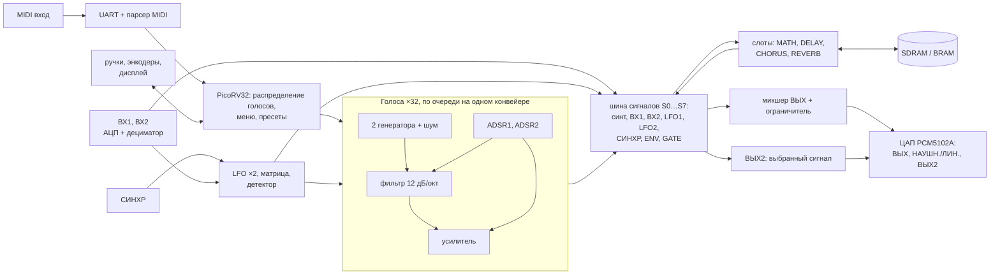

Частота отсчётов ≈ 48.34 кГц (PLL 99 МГц из кварца 27 МГц); внутри — 18 бит, 1.0 = 1 МЕ.
Подробности архитектуры и карта регистров — [`fpga/README.md`](fpga/README.md) и ТЗ
[`.plans/fpga-synth/trs.md`](.plans/fpga-synth/trs.md).

## Аппаратная часть

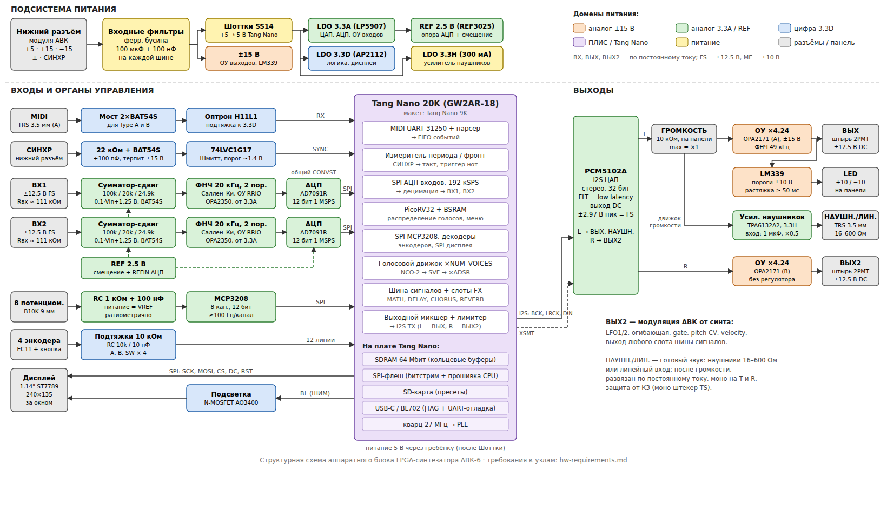

Цвет блока — домен питания. Всё питание приходит с нижнего разъёма модуля (+5, ±15 В):
Tang Nano питается через диод Шоттки (чтобы USB при прошивке не питал АВК), аналоговая часть —
от отдельного малошумящего LDO 3.3A и опоры 2.5 В, цифра — от LDO 3.3D, усилитель наушников —
от своего LDO 3.3H.

- **Входы ВХ1/ВХ2:** резисторный сумматор-сдвиг (0.1·Vin + 1.25 В, Rвх ≈ 111 кОм, выдерживает ±15 В) →
  ФНЧ 20 кГц 2-го порядка → 12-битный АЦП AD7091R. Оба АЦП запускаются одновременно, опора общая со
  смещением — поэтому A·B и A/B в слоте MATH не страдают от сдвига фаз и дрейфа.
- **MIDI** — через диодный мост (работает с кабелями TRS тип A и B) и оптрон; **СИНХР** с нижнего
  разъёма — через ограничитель и триггер Шмитта (ТТЛ и ±10 В).
- **Ручки** — через 8-канальный MCP3208, энкодеры и дисплей — прямо на ПЛИС.
- **ЦАП PCM5102A:** левый канал → ГРОМКОСТЬ → ОУ ×4.24 → ВЫХ (±12.5 В, индикаторы ±10 на LM339)
  и усилитель наушников TPA6132A2 → НАУШН./ЛИН.; правый канал → ОУ ×4.24 → ВЫХ2.

Требования к каждому узлу — [`hw-requirements.md`](.plans/fpga-synth/hw-requirements.md); принципиальная схема по узлам
(листы, номиналы, подключение по выводам) — [`hw/schematic.md`](hw/schematic.md);
плата и чертёж панели — [`hw/`](hw/README.md).

## Панель

| Элемент | Назначение |
|---|---|
| СРЕЗ, РЕЗОН., ENV→Ф, FX MIX | срез фильтра, резонанс, глубина огибающей на срез, уровень эффектов |
| A, D, S, R | огибающая громкости ADSR1 |
| ГРОМКОСТЬ | аналоговый регулятор выхода; индикаторы +10 / −10 — выход у границы МЕ |
| Энкодер МЕНЮ | листает страницы меню, нажатие — на первую страницу |
| Энкодеры ПАР.1–3 | меняют три параметра текущей страницы; кнопки ПАР.1/ПАР.2 на странице «ПРЕСЕТЫ» — загрузить / записать |
| ВХ1, ВХ2 | входы от АВК, ±12.5 В по постоянному току; штыри 2РМТ: ВХ1 — левый край по центру, ВХ2 — верхний край, 61 мм от левого угла |
| ВЫХ, ВЫХ2 | выходы в АВК: звук и второй канал (см. [ВЫХ2](#выход-2)); ВЫХ — правый край по центру, ВЫХ2 — нижний край, 61 мм от левого угла |
| MIDI | TRS 3.5 мм тип A (тип B тоже работает), слева — со стороны входов |
| НАУШН./ЛИН. | TRS 3.5 мм, справа — со стороны выходов: готовый звук после ГРОМКОСТИ, наушники 16–600 Ом или линейный вход; моно на оба канала, без постоянной составляющей |
| Дисплей | 1.14″ 240×135, меню и строка состояния |

Штыри ВХ/ВЫХ стоят на сетке перемычек АВК-6 (4 мм от края), чтобы соединять модуль с соседними
короткими скобами. Земли на панели нет — она есть на других модулях; СИНХР приходит через нижний
разъём. Эскиз в масштабе — [`panel-sketch.svg`](.plans/fpga-synth/panel-sketch.svg).

## Голос: генераторы

Два генератора на голос, их смесь и шум. Форма у каждого своя (`wave1`, `wave2`), второй генератор
можно сдвинуть на полутоны (`osc2semi`) и расстроить в центах (`detune`) — отсюда «толстый» звук.
Скважность `pw` задаёт ширину импульса меандра, её можно модулировать LFO (ШИМ).

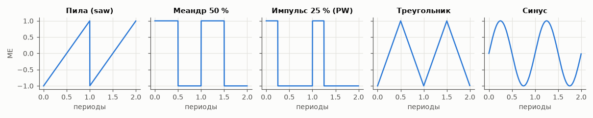

**PolyBLEP** (`blep on`). У пилы и меандра бесконечно крутые скачки; на цифровой частоте отсчётов их
гармоники выше половины fs «заворачиваются» вниз и слышны как негармонический призвук на высоких
нотах. PolyBLEP сглаживает два отсчёта у каждого скачка по-полиномиальному — форма почти не
меняется, а завёрнутые частоты падают примерно на 15 дБ:

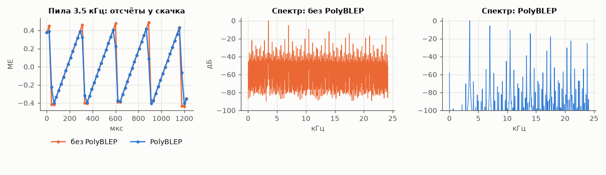

**Жёсткая синхронизация** (`hsync osc1|osc2|both`). Каждый фронт на входе СИНХР перезапускает фазу
выбранных генераторов. Высота звука привязывается к частоте СИНХР, а собственная частота генератора
меняет тембр — классический «sync-звук», управляемый генератором АВК:

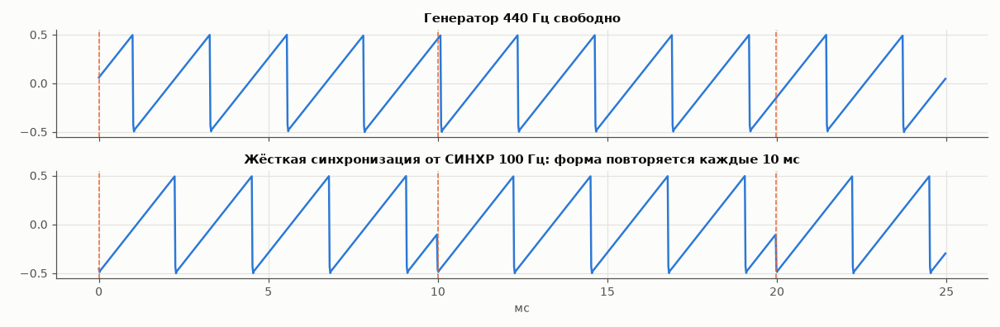

## Фильтр

Резонансный фильтр переменных состояний (Chamberlin, 12 дБ/окт, с двукратной передискретизацией) на
каждый голос. Режим `fmode`: **ФНЧ** (lp) — убирает верх, **полосовой** (bp) — оставляет полосу у среза,
**ФВЧ** (hp) — убирает низ. Резонанс (ручка РЕЗОН., добротность Q 0.5…20) поднимает частоты у среза;
при большом Q фильтр «звенит».

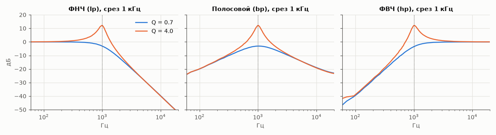

Во времени: ФНЧ скругляет скачки пилы, с высоким резонансом на каждом скачке появляется затухающий
звон на частоте среза:

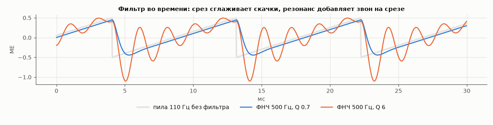

Срез складывается из: ручки СРЕЗ, огибающей ADSR2 × `env2amt` (± 4 октавы), силы нажатия × `velcut`
и маршрутов матрицы модуляции (например, ВХ1 → срез: генератор АВК «открывает» фильтр).

## Огибающие

**ADSR1** — громкость голоса (ручки A, D, S, R), **ADSR2** — срез фильтра (страницы «ADSR2»). Атака идёт
к 1.0 по экспоненте с «запасом» (как у аналоговых огибающих), спад и затухание — экспоненциальные;
время — до уровня −60 дБ. Повторное нажатие той же ноты перезапускает огибающие.

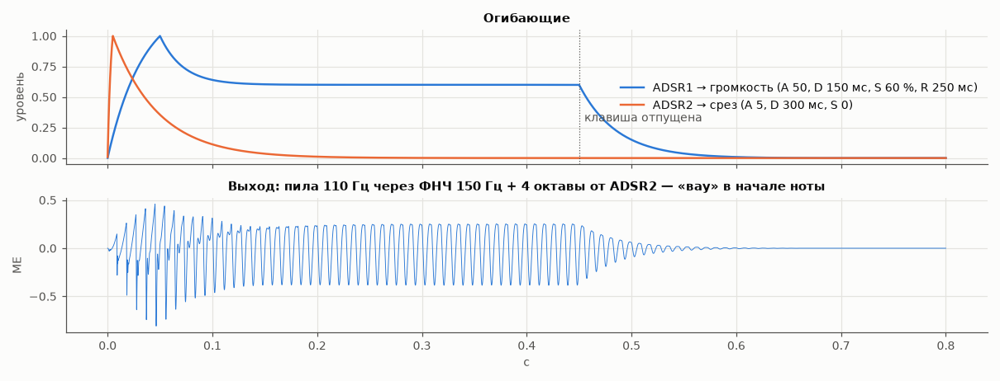

## Модуляция: LFO, матрица, детектор

**Два LFO** (0.01…50 Гц): синус, треугольник, пила вверх и вниз, меандр, случайный (выборка-хранение).
В режиме `syncmode lfo` фронт СИНХР сбрасывает их фазу — LFO идут в такт с АВК.

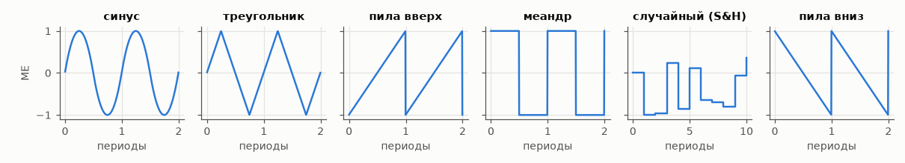

**Матрица модуляции** — 8 маршрутов «источник × глубина × через»: значение источника умножается на
глубину и, если задан, на третий сигнал «через» (например, LFO1 × колесо модуляции = вибрато, маршрут 0).

| Источники | Назначения |
|---|---|
| 1 LFO1, 2 LFO2, 3 колесо модуляции, 4 ВХ1, 5 ВХ2, 6 СИНХР (±1), 7 ENV (ADSR1 последней ноты), 8 GATE, 9 AUX (из прошивки), 10 детектор огибающей | 1 высота (1 МЕ = октава при глубине 65536), 2 срез, 3 громкость (AM), 4 скважность (ШИМ) |

Маршруты 1…7 задаются из консоли: `route <k> <источник> <через> <назначение> <глубина>`,
например `route 1 4 0 1 65536` — ВХ1 управляет высотой, 1 МЕ (10 В) = октава.

**Следящий детектор огибающей** (источник 10) выделяет громкость сигнала ВХ1 или ВХ2 (`follsrc`), с
отдельными временами атаки и спада (`follatk`, `follrel`). Им удобно, например, открывать фильтр
громкостью сигнала из АВК:

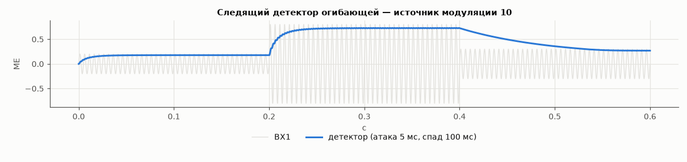

## Связь с АВК

**Входы ВХ1, ВХ2.** Два 12-битных АЦП опрашиваются с учетверённой частотой и проходят через
64-отводный цифровой ФНЧ (полоса 21.5 кГц). Нуль и масштаб калибруются командой `cal`.
Входы можно подмешать прямо в выход (`in1mix`, `in2mix`), направить в матрицу модуляции или на
вход любого эффекта.

**Вход СИНХР** (после компаратора) — `syncmode`:
- `off` — только измерение частоты (команда `avk`);
- `lfo` — фронт сбрасывает фазу LFO;
- `note` — каждый фронт перезапускает ноту `syncnote`: АВК «играет» синтезатором.

Также СИНХР задаёт время задержек (`dlysync on`) и жёстко синхронизирует генераторы (`hsync`).

**Шина сигналов.** Всё, что можно смешивать и обрабатывать, лежит на общей шине: S0 синтезатор,
S1 ВХ1, S2 ВХ2, S3 LFO1, S4 LFO2, S5 СИНХР (±1), S6 ENV, S7 GATE, дальше — выходы слотов эффектов.
Вход каждого эффекта — любой сигнал шины, в том числе выход другого эффекта.

**Выход 2** (`out2src`, `out2gain`): любой сигнал шины (по умолчанию LFO1) — так синтезатор
модулирует блоки АВК своими LFO, огибающей или GATE; либо `pitch` — напряжение высоты последней
ноты, 1 В/окт (0 В = нота 60, до первой октавы).

**Выходной микшер.** ВЫХ = синтезатор + подмешанные входы + эффекты (каждый со своим уровнем),
через мягкий ограничитель: до 1 МЕ (10 В) сигнал проходит без искажений, выше плавно упирается
в 1.25 МЕ — перегрузка микшера не даёт жёсткой отсечки:

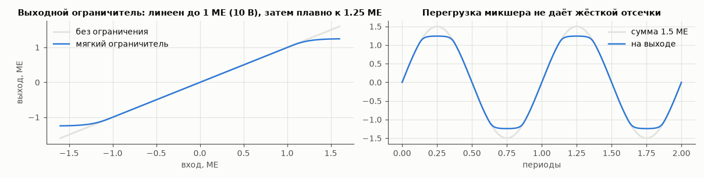

## Эффекты

Эффекты — это **слоты** на шине сигналов. У каждого слота вход A (и B) — любой сигнал шины, выход
слота снова попадает на шину и в микшер с уровнем «уровень × FX MIX» (ручка FX MIX масштабирует все
эффекты сразу). На 20K шесть слотов: MATH, MATH, DELAY, DELAY, CHORUS, REVERB; на 9K — MATH, MATH,
DELAY (у 9K мало памяти). Эффекты с памятью работают и в обходе — линия задержки остаётся
заполненной, эффект включается без провала.

### MATH — математика над сигналами

Два слота повторяют математические блоки АВК над любыми двумя сигналами шины (`slot1a`, `slot1b`):

| `slot1op` | Операция | Для чего |
|---|---|---|
| `mul` | A·B | кольцевой модулятор, VCA под управлением АВК |
| `div` | A/B | деление напряжений (с насыщением) |
| `abs` | \|A\| | выпрямитель, удвоение частоты |
| `add`, `sub` | A+B, A−B | сумматор |
| `min`, `max` | min(A, B), max(A, B) | ограничители, логика |
| `mod` | A mod B | остаток — «пилообразное» свёртывание |
| `axpb` | A·k+B | масштаб и смещение (`slot1k`, −2…+2) |

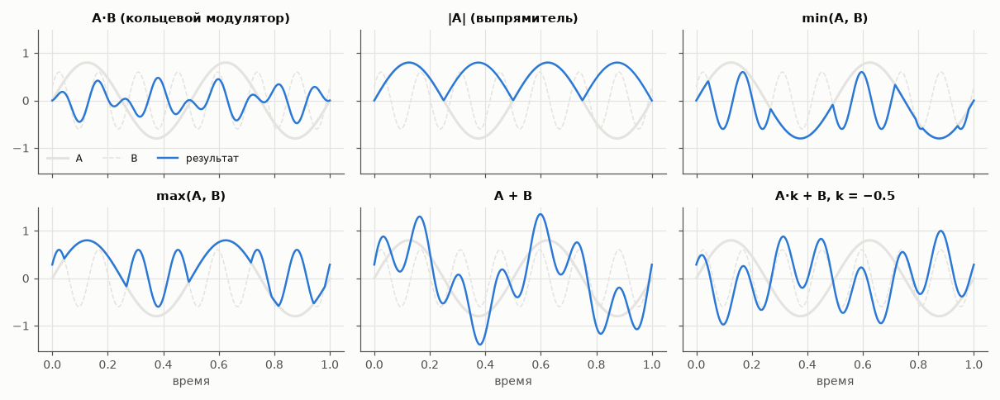

Например: `set slot1op 1` (mul), `slot1a in1`, `slot1b in2`, `fxmix 100` — на выходе произведение двух
сигналов АВК; синус 300 Гц × синус 1 кГц даёт 700 и 1300 Гц (проверено в системном тесте).

### DELAY — задержка

Две независимых линии задержки (на 9K — одна): вход (`dly1src`, `dly2src`, по умолчанию ВХ1 и ВХ2),
время (`dly1time`, до 20 с; памяти хватает на ~21 с на линию на 20K и на 85 мс на 9K), повтор —
обратная связь (`dly1fb`, −99…99 %), уровень в выход (`dly1lvl`). `dlysync on` — время задержки равно периоду СИНХР: эхо в такт с АВК.

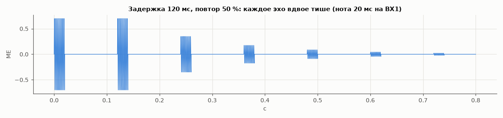

### CHORUS / FLANGER — хорус и флэнжер

Копия сигнала с задержкой, которая медленно «плавает» (треугольный LFO внутри слота), смешивается
с оригиналом. Параметры: базовая задержка `chobase` (0.1…20 мс), глубина качания `chodepth`,
частота `chorate`, повтор `chofb`, уровень `cholvl`.

- **Хорус** — задержка 5…20 мс, без повтора: звук «размножается», уровень и фаза дышат.

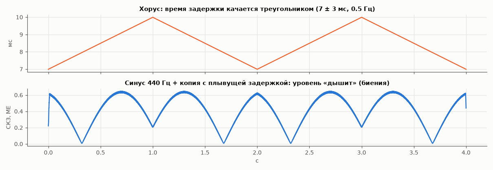

- **Флэнжер** — задержка 0.5…5 мс с сильным повтором: получается гребёнка провалов по спектру,
  которая ездит вверх-вниз («реактивный» звук). На шуме это видно на спектрограмме:

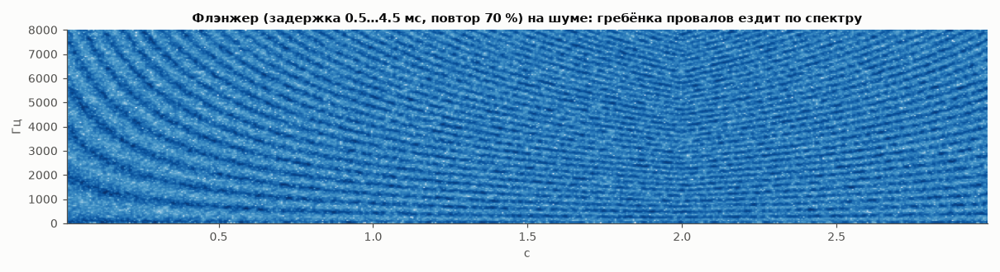

### REVERB — реверберация

Классическая схема Шрёдера/Freeverb: 4 параллельных гребенчатых фильтра с глушением в обратной
связи и 2 последовательных всепропускающих. `revroom` — размер помещения (длительность хвоста),
`revdamp` — глушение (чем больше, тем быстрее гаснут высокие), `revlvl` — уровень, `revsrc` — вход
(по умолчанию синтезатор; можно реверберировать и сигнал АВК).

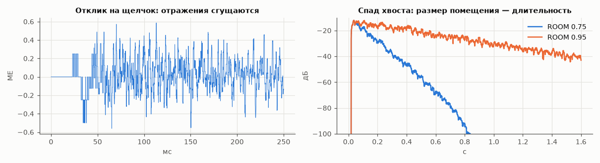

### Как добавить эффект

Эффект = RTL-модуль со стандартным интерфейсом слота (`fpga/rtl/avk/slot_*.sv`: `start`, A, B →
`y`, `done`; параметры; порт памяти) + строка в списке слотов (`SLOT_TYPES`) + описание в прошивке
(`sw/fw/avk.c`). Для каждого слота есть Python-модель, с которой RTL сверяется бит-в-бит.

## Меню: как пользоваться

Меню — это 22 страницы по три параметра. Верхняя строка — название и номер страницы, ниже три
параметра с текущими значениями, внизу строка состояния.

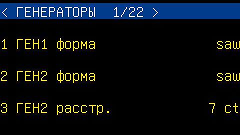

- **Энкодер МЕНЮ** листает страницы по кругу (назад с первой — на последнюю). **Нажатие МЕНЮ** —
  сразу на первую страницу.
- **Энкодеры ПАР.1, ПАР.2, ПАР.3** меняют первый, второй и третий параметр страницы. Шаг зависит от
  единиц: частоты, времена и добротность меняются примерно на 6 % за щелчок (быстро проходят весь
  диапазон), остальные — на 1/200 диапазона, перечисления — на один вариант.
- **Восемь ручек** закреплены за своими параметрами (СРЕЗ, РЕЗОН., ENV→Ф, FX MIX, A, D, S, R). Ручка
  не перехватывает параметр, пока её не повернули: после загрузки пресета значения не прыгают, а при
  первом повороте параметр переходит к положению ручки. По краям хода — «мёртвые зоны», чтобы
  уверенно доставать минимум и максимум. Срез, резонанс и времена — по экспоненте, остальное — линейно.
  При повороте ручки строка состояния на 1.5 с показывает новое значение:

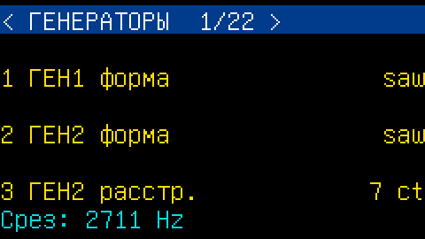

- Строка состояния также показывает последнее MIDI-событие и результат записи/загрузки пресета.
- Все параметры меню доступны и из консоли (`set <имя> <значение>`, имена — в таблице).

Все страницы:

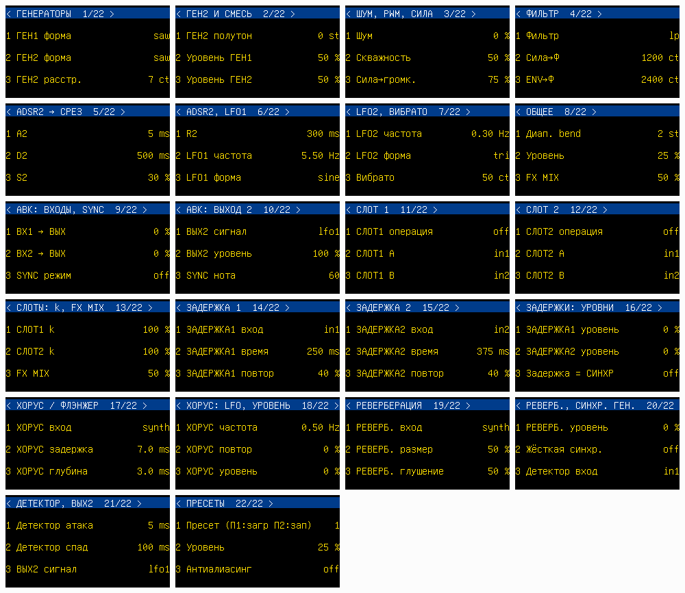

| № | Страница | ПАР.1 | ПАР.2 | ПАР.3 |
|---|---|---|---|---|
| 1 | ГЕНЕРАТОРЫ | ГЕН1 форма (`wave1`) | ГЕН2 форма (`wave2`) | ГЕН2 расстр. (`detune`) |
| 2 | ГЕН2 И СМЕСЬ | ГЕН2 полутон (`osc2semi`) | Уровень ГЕН1 (`mix1`) | Уровень ГЕН2 (`mix2`) |
| 3 | ШУМ, PWM, СИЛА | Шум (`noise`) | Скважность (`pw`) | Сила→громк. (`velamp`) |
| 4 | ФИЛЬТР | Фильтр (`fmode`) | Сила→Ф (`velcut`) | ENV→Ф (`env2amt`) |
| 5 | ADSR2 → СРЕЗ | A2 (`a2`) | D2 (`d2`) | S2 (`s2`) |
| 6 | ADSR2, LFO1 | R2 (`r2`) | LFO1 частота (`lfo1rate`) | LFO1 форма (`lfo1wave`) |
| 7 | LFO2, ВИБРАТО | LFO2 частота (`lfo2rate`) | LFO2 форма (`lfo2wave`) | Вибрато (`vibrato`) |
| 8 | ОБЩЕЕ | Диап. bend (`bend`) | Уровень (`master`) | FX MIX (`fxmix`) |
| 9 | АВК: ВХОДЫ, SYNC | ВХ1 → ВЫХ (`in1mix`) | ВХ2 → ВЫХ (`in2mix`) | SYNC режим (`syncmode`) |
| 10 | АВК: ВЫХОД 2 | ВЫХ2 сигнал (`out2src`) | ВЫХ2 уровень (`out2gain`) | SYNC нота (`syncnote`) |
| 11 | СЛОТ 1 | СЛОТ1 операция (`slot1op`) | СЛОТ1 A (`slot1a`) | СЛОТ1 B (`slot1b`) |
| 12 | СЛОТ 2 | СЛОТ2 операция (`slot2op`) | СЛОТ2 A (`slot2a`) | СЛОТ2 B (`slot2b`) |
| 13 | СЛОТЫ: k, FX MIX | СЛОТ1 k (`slot1k`) | СЛОТ2 k (`slot2k`) | FX MIX (`fxmix`) |
| 14 | ЗАДЕРЖКА 1 | ЗАДЕРЖКА1 вход (`dly1src`) | ЗАДЕРЖКА1 время (`dly1time`) | ЗАДЕРЖКА1 повтор (`dly1fb`) |
| 15 | ЗАДЕРЖКА 2 | ЗАДЕРЖКА2 вход (`dly2src`) | ЗАДЕРЖКА2 время (`dly2time`) | ЗАДЕРЖКА2 повтор (`dly2fb`) |
| 16 | ЗАДЕРЖКИ: УРОВНИ | ЗАДЕРЖКА1 уровень (`dly1lvl`) | ЗАДЕРЖКА2 уровень (`dly2lvl`) | Задержка = СИНХР (`dlysync`) |
| 17 | ХОРУС / ФЛЭНЖЕР | ХОРУС вход (`chosrc`) | ХОРУС задержка (`chobase`) | ХОРУС глубина (`chodepth`) |
| 18 | ХОРУС: LFO, УРОВЕНЬ | ХОРУС частота (`chorate`) | ХОРУС повтор (`chofb`) | ХОРУС уровень (`cholvl`) |
| 19 | РЕВЕРБЕРАЦИЯ | РЕВЕРБ. вход (`revsrc`) | РЕВЕРБ. размер (`revroom`) | РЕВЕРБ. глушение (`revdamp`) |
| 20 | РЕВЕРБ., СИНХР. ГЕН. | РЕВЕРБ. уровень (`revlvl`) | Жёсткая синхр. (`hsync`) | Детектор вход (`follsrc`) |
| 21 | ДЕТЕКТОР, ВЫХ2 | Детектор атака (`follatk`) | Детектор спад (`follrel`) | ВЫХ2 сигнал (`out2src`) |
| 22 | ПРЕСЕТЫ | Пресет (`preset`) | Уровень (`master`) | Антиалиасинг (`blep`) |

Параметры ручек — `cutoff`, `res`, `env2amt`, `fxmix`, `a1`, `d1`, `s1`, `r1` — доступны и из консоли.

## Пресеты, SD-карта, обновление прошивки

На карте (FAT16 или FAT32, файлы в корне) пресеты лежат как `PRESET00.BIN` … `PRESET99.BIN`: все
параметры и маршруты матрицы 1…7. Пресет хранит значения по именам параметров, поэтому старые
пресеты загружаются и после обновления прошивки с новыми параметрами.

- **С панели:** последняя страница «ПРЕСЕТЫ», ПАР.1 — номер; **нажатие ПАР.1 — загрузить,
  нажатие ПАР.2 — записать**. Результат — в строке состояния.
- **Из консоли:** `save 5`, `load 5`, `ls` — список файлов, `sd` — переподключить карту.
- **Обновление прошивки:** положить `FIRMWARE.BIN` в корень карты и дать команду `fwupdate` —
  образ копируется во флеш (с проверкой CRC перед записью заголовка) и загружается при следующем
  включении. Без карты прошивку можно залить по USB-UART: `sw/tools/load.py`.

## Консоль

USB-UART Tang Nano (115200 бод): `help`, `list`, `get`/`set <параметр> <значение>`,
`route …`, `note <n> [vel]` / `off <n>`, `screen`, `panel`, `avk`, `cal <1|2> zero|<мВ>`,
`mem`, `sd`, `ls`, `save`, `load`, `fwupdate`. Подробно — [`sw/README.md`](sw/README.md).

## Сборка и проверка

Из корня репозитория (Ubuntu 24.04: Verilator, gcc-riscv64-unknown-elf, Python 3 с numpy/scipy/matplotlib/cocotb):

| Команда | Что делает |
|---|---|
| `make test` | линт RTL, тесты моделей, хост-тесты прошивки, юнит-тесты RTL (cocotb), системные тесты ядра — то же, что CI |
| `make fw` | прошивка RISC-V → `build/sw/fw.bin` |
| `make bitstream-20k`, `make bitstream-9k` | битстрим в Gowin EDA (локально) |
| `make readme-img` | картинки этого README |
| `make plots` | графики симуляции в `fpga/sim/img` |

Дальше: [`fpga/README.md`](fpga/README.md) — RTL, платы, тестбенч; [`fpga/sim/README.md`](fpga/sim/README.md)
— что и как проверяется, с графиками по этапам; [`sw/README.md`](sw/README.md) — прошивка;
[`.plans/fpga-synth/plan.md`](.plans/fpga-synth/plan.md) — план и статус этапов.

## Что ещё нужно проверить на железе

- распиновка: ручки, энкодеры, дисплей, АЦП, СИНХР, SD-карта пока не назначены (вопрос HO-01);
- фаза тактового сигнала встроенной SDRAM 20K (HO-07; команда `mem` для проверки);
- ресурсы и тайминг 32 голосов и 6 слотов в Gowin EDA;
- калибровка входов по реальному входному каскаду (`cal`);
- инициализация конкретного модуля ST7789, направление энкодеров, совместимость SD-карт;
- PSRAM на 9K не используется (нужен IP Gowin) — на 9K одна задержка до 85 мс, без хоруса и реверберации.
