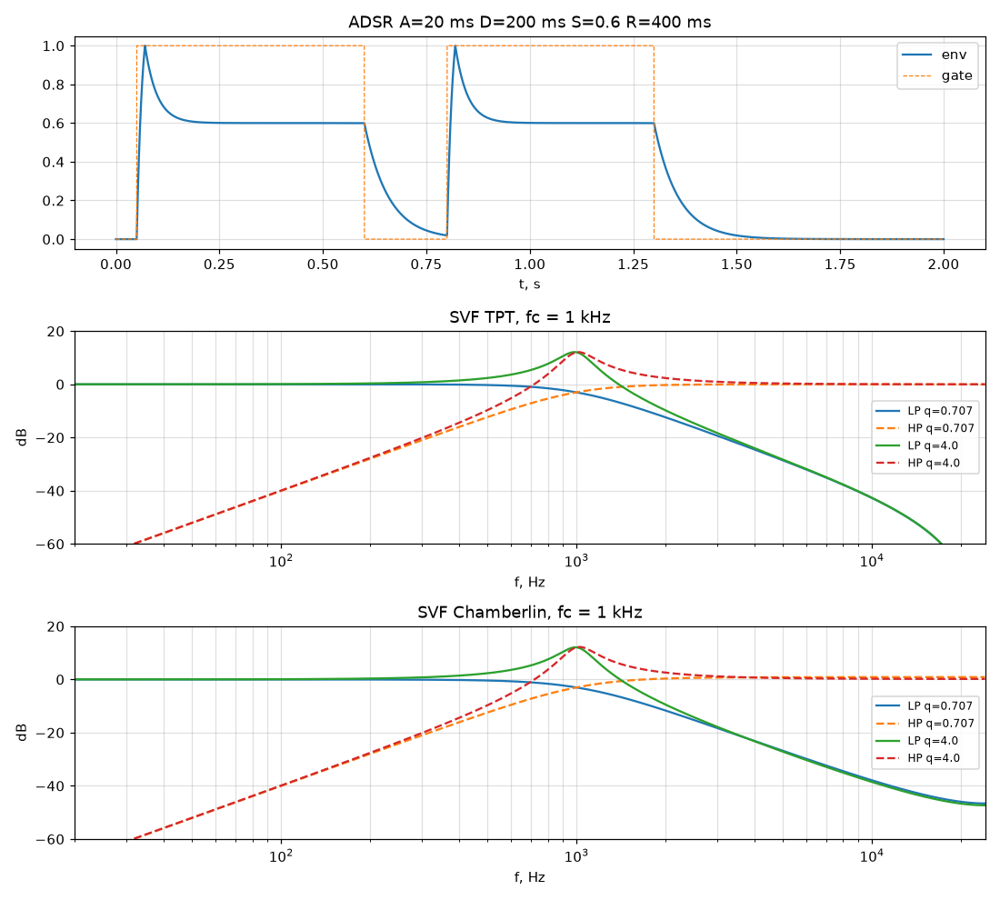

# Python-модели DSP-блоков

Пакет `synthmodel` — эталоны для RTL: WAV для прослушивания и сравнения с выходом симуляции.
Тесты — `make model` (pytest), эталонные WAV и графики — в `build/model/` (в CI — артефакт `model-refs`).

| Модуль | Что моделирует | Точность |
|---|---|---|
| `clocks` | делитель sys_clk → BCK/fs, инкременты фазы, таблица нот | побитово с RTL |
| `nco` | аккумулятор фазы + четвертьволновая таблица синуса, пила | побитово с `nco_sine.sv` |
| `adsr` | огибающая ADSR с экспоненциальными участками | float, эталон поведения |
| `svf` | SVF: TPT/ZDF (Simper/Zavalishin) и Chamberlin; ФНЧ/ПФ/ФВЧ, модулируемый срез | float |
| `analysis` | спектр, основной тон, THD, THD+N | — |
| `luts` | генерация `rtl/audio/sine_quarter_rom.sv` (`make luts`) | — |
| `wavio` | чтение/запись PCM WAV 16/24/32 бит | — |

- **ADSR** (A = 20 мс, D = 200 мс, S = 0.6, R = 400 мс): атака — экспонента к цели 1.3, обрывается на 1.0
  ровно через A; D и R — время спада до −60 дБ от расстояния до цели. Второе нажатие во время
  затухания перезапускает атаку с текущего уровня, без щелчка.
- **SVF TPT**: точная АЧХ на частоте среза (усиление ФНЧ и ПФ на fc = q), устойчив до fs/2.
- **SVF Chamberlin**: дешевле в фиксированной точке, но АЧХ искажается при приближении к fs/2
  (плато ФНЧ около −47 дБ, подъём ФВЧ) и фильтр неустойчив выше ≈ fs/6. Выбор для RTL — на этапе 4.

График в репозитории обновляется командой `make plots`.
