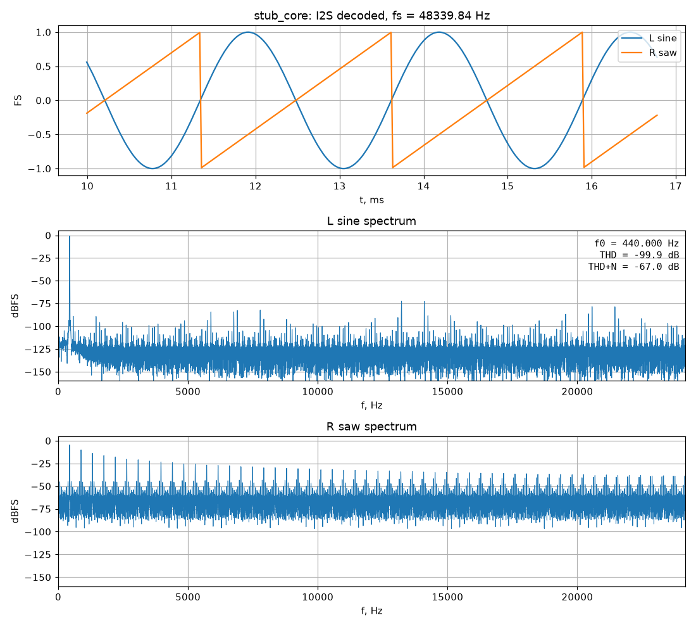
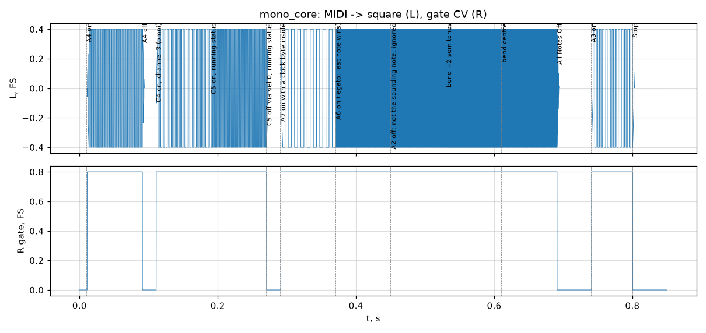
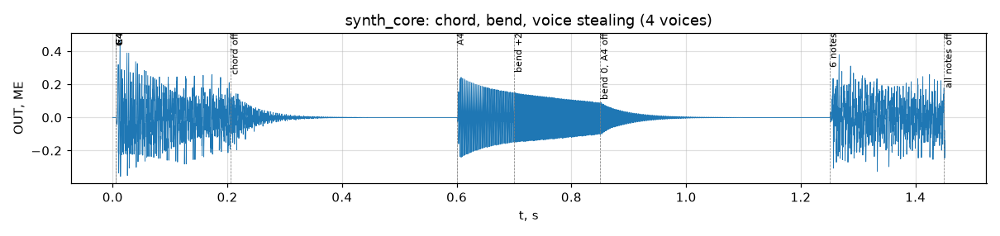
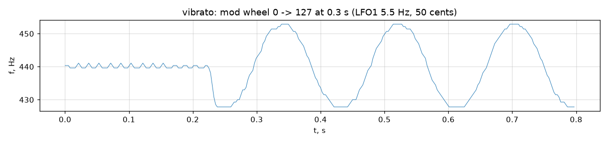
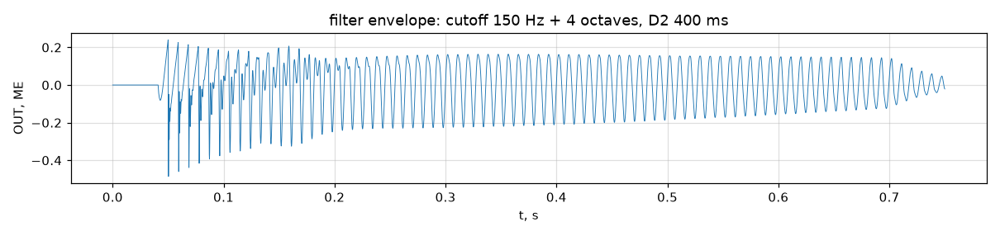
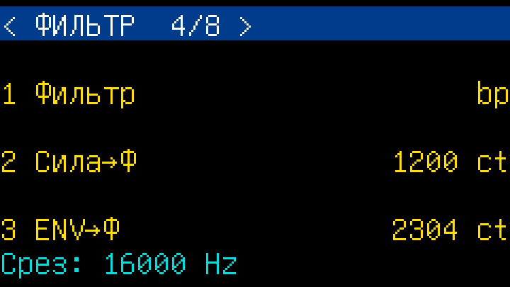
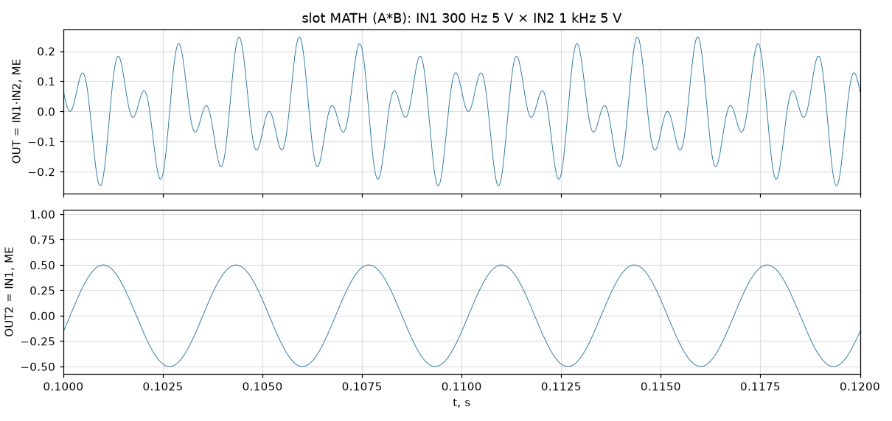
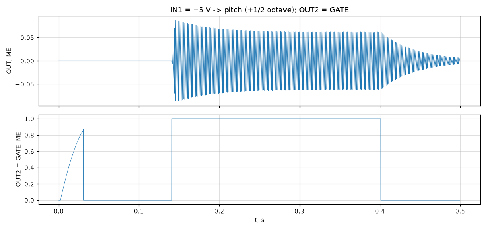
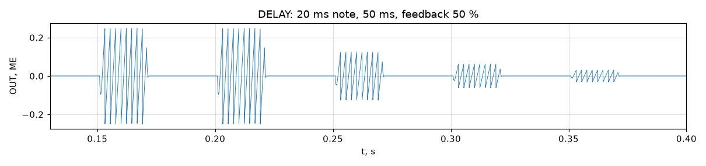
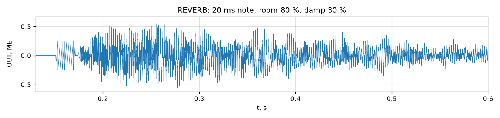

# Симуляция (Verilator)

Запуск: `make sim` из корня. Как устроены тестбенч, стимулы и проверки — в [`../README.md`](../README.md#что-проверяется).

## Этап 0: `stub_core` — синус → I2S → WAV

Выход I2S, декодированный тестбенчем на уровне выводов (как принимает PCM5102A), 0.3 с симуляции,
sys_clk 99 МГц, fs = 48 339.84 Гц.

- вверху — левый канал (синус 440 Гц) и правый (пила того же NCO);
- в середине — спектр синуса: THD ≈ −100 дБ, THD+N ≈ −67 дБ; шум и отдельные пики на −75…−90 дБ —
  от усечения фазы до 12 бит (таблица 1024 точки на четверть периода, без интерполяции);
- внизу — спектр пилы: гармоники спадают как 1/n (H2 = −6 дБ), выше — наложение спектров
  (наивная пила без PolyBLEP, P1).

Результаты проверок последнего прогона:

| Проверка | Значение | Допуск |
|---|---|---|
| Формат I2S, тайминг, эхо MIDI (22 байта) | ошибок нет | — |
| fs | 48 339.84 Гц (+0.71 %) | ≤ 3 % |
| Тон L | 440.000 Гц | 440 ± 0.5 % |
| THD / THD+N | −99.9 / −67.0 дБ | ≤ −70 / ≤ −60 дБ |
| Пик L | 0.99999 FS | 0.99…1.0 |
| Тон R (пила), H2/H1 | 439.999 Гц, −6.02 дБ | ± 0.5 %, −6.02 ± 1 дБ |
| L, R против `synthmodel.nco` | совпадают побитово | точно |

График в репозитории обновляется командой `make plots` (свежие графики каждого прогона — в артефактах CI).

## Этап 1: `mono_core` — MIDI → один голос

Одноголосное ядро без процессора (как MIDI2AUX): парсер MIDI, FIFO событий, последняя нота,
pitch bend ±2 полутона, меандр ±0.5 МЕ на ВЫХ (L) с плавным включением 2.6 мс, гейт +10 В на ВЫХ2 (R).
Тест `system/test_mono_core.py` проверяет частоту каждой ноты (± 0.1 %), гейт, тишину и задержку.

## Этап 3: `synth_core` — полифония

PicoRV32 с прошивкой (`sw/fw`) распределяет голоса и пишет регистры голосового движка
(`fpga/rtl/voice/voice_engine.sv`, 22 такта на голос, общий умножитель). Тест
`system/test_synth_core_voices.py` (4 голоса для скорости симуляции): аккорд C4–E4–G4 (все три
основных тона ± 0.2 %), затухание release до тишины, pitch bend +2 полутона, 6 нот на 4 голосах —
звучат последние четыре, две самые старые украдены.

Юнит-тест `unit/test_voice_engine.py` сравнивает RTL движка с моделью `synthmodel.voice`
**побитово** на случайных параметрах, гейтах, ретриггерах и модуляции (2800 отсчётов);
`unit/test_softclip.py` — мягкий ограничитель.

## Этап 4: модуляция — LFO, вибрато, огибающая фильтра

Блок модуляции (`fpga/rtl/voice/mod_unit.sv`, побитово = `synthmodel.modunit`): 2 LFO (синус, треугольник,
пила вверх/вниз, меандр, случайный S&H), матрица из 8 маршрутов «источник × глубина × via → приёмник»
(высота, срез, громкость, ширина импульса). Маршрут 0 — вибрато: LFO1 × mod wheel → высота.
Параметры в тестах задаются через консоль UART прошивки (`set <param> <value>`).

Вибрато (`test_synth_core_mod.py`): mod wheel 0 → 127 на 0.3 с, частота основного тона по кадрам:
до — 440 Гц, после — ±50 центов с частотой 5.5 Гц.

Огибающая фильтра: срез 150 Гц + 4 октавы от ADSR2 (D2 = 400 мс, S2 = 0) — спектральный центроид
в начале ноты больше, чем в конце, более чем втрое.

## Этап 5: панель — ручки, энкодеры, дисплей

RTL: опрос MCP3208 (`panel/periph_pots.sv`, 8 каналов, сглаживание), декодер энкодеров с антидребезгом
(`panel/periph_enc.sv`), потоковый контроллер ST7789 с аппаратной заливкой и развёрткой 1-битных
глифов (`panel/lcd_ctrl.sv`). Прошивка: меню из таблицы параметров (энкодер МЕНЮ — страницы,
ПАР.1–3 — параметры страницы), 8 фиксированных ручек (подхватывают параметр при первом повороте),
строка статуса; вывод на экран не блокирует обработку MIDI (текстовая модель экрана, изменившиеся
ячейки отправляются, пока в FIFO контроллера есть место).

В тестбенче — модели MCP3208, энкодеров и дисплея ST7789 (кадровый буфер). Тест
`system/test_synth_core_panel.py` крутит энкодеры и ручку и сравнивает кадр дисплея **попиксельно**
с эталоном, отрисованным в Python тем же шрифтом. Кадр из симуляции (×3):

`system/test_synth_core_latency.py`: задержка MIDI → звук при непрерывной перерисовке меню —
25 нот, максимум 0.7 мс (требование ТЗ — ≤ 3 мс).

## Этап 6: связь с АВК — входы, СИНХР, шина сигналов, слоты

RTL: `avk/adc_in.sv` (два AD7091R, 4·fs, калибровка, КИХ-дециматор), `avk/sync_in.sv` (фронты, период),
`avk/fx_bus.sv` (шина сигналов, слоты, микшеры ВЫХ/ВЫХ2), `avk/slot_math.sv` (слот MATH). Юнит-тесты
`unit/test_avk_bus.py`, `unit/test_avk_inputs.py` сравнивают RTL с `synthmodel/avk.py` бит-в-бит.

В тестбенче — модель пары AD7091R с идеальным входным каскадом (−12.5…+12.5 В → 0…4095) и источник
СИНХР: `--in1`, `--in2`, `--sync` принимают `dc:V`, `sine:F:A[:DC]`, `square:F:A[:DC]`, `saw:F:A[:DC]`
(в UART-сценарии — команды `in1`/`in2`/`sync` с тем же форматом).

`system/test_synth_core_avk.py`:
- кольцевой модулятор: ВХ1 (300 Гц, 5 В) × ВХ2 (1 кГц, 5 В) в слоте MATH → ВЫХ: 700 и 1300 Гц по 0.125 МЕ,
  исходные частоты подавлены; ВЫХ2 = ВХ1;

  
- ВХ1 = +5 В через матрицу модуляции → высота тона (1 МЕ = октава): ля 440 Гц звучит на пол-октавы выше;
  ВЫХ2 = GATE (1 МЕ, пока нажата клавиша);

  
- СИНХР 100 Гц: консоль `avk` показывает частоту; в режиме «нота» каждый фронт перезапускает ноту 60.

## Этап 7: внешняя память, слот DELAY

RTL: `mem/mem_arb.sv`, `mem/mem_bram.sv`, `mem/sdram_ctrl.sv`, `avk/slot_delay.sv`. Юнит-тесты:
`unit/test_mem.py` — контроллер SDRAM против модели микросхемы, проверяющей временные параметры
команд, инициализацию и интервал регенерации, случайные чтения/записи с маской байтов; арбитр + BRAM
с двумя мастерами; `unit/test_avk_bus.py::test_fx_bus_delay` — слоты MATH + 2 × DELAY бит-в-бит с моделью
при случайной задержке памяти.

В тестбенче — модель внешней памяти на порту `xm_*` (`--xmem-words`, `--xmem-latency`: случайная
задержка 0…N тактов). `system/test_synth_core_delay.py`: эхо 50 мс с обратной связью 50 % (задержка
точно 2417 отсчётов, уровни 1, 1/2, 1/4, …), время задержки от периода СИНХР, запись и чтение памяти
процессором через окно `0x4000_0000` одновременно с работой слотов.

## Этап 8: хорус, реверберация, жёсткая синхронизация, детектор огибающей

RTL: `avk/slot_chorus.sv`, `avk/slot_reverb.sv`; `voice/voice_engine.sv` — регистр HSYNC и вход
`sync_edge`; `voice/mod_unit.sv` — детектор огибающей (источник 10). Юнит-тесты: слоты бит-в-бит
(`unit/test_avk_bus.py::test_fx_bus_chorus_reverb`), жёсткая синхронизация в `unit/test_voice_engine.py`,
детектор в `unit/test_mod_unit.py`.

`system/test_synth_core_fx.py`: хвост реверберации затухает (без неё — тишина после ноты); хорус
даёт биения уровня без смены высоты; генератор 440 Гц, синхронизированный СИНХР 100 Гц, повторяется
каждые 10 мс и имеет спектр гармоник 100 Гц; ВХ1 → детектор → высота тона; ВЫХ2 = +1 В для ноты до
второй октавы.

## Этап 9: SD-карта — пресеты, обновление прошивки

В тестбенче — SD-карта в режиме SPI (`models/sd_card_model.h`, общая с хост-тестами прошивки) на выводах
`sd_*`: `--sd-image` образ карты, `--sd-dump` образ после прогона, `--sd-sdsc` — карта со словной
адресацией. Образы FAT16 делает `sw/tools/fatimg.py`. `system/test_synth_core_storage.py`: запись и загрузка
пресетов из консоли и кнопками панели (записанный образ проверяется независимым чтением FAT), отсутствие
карты, `fwupdate` — FIRMWARE.BIN → флеш, затем загрузчик в ROM загружает эту прошивку с флеша.
