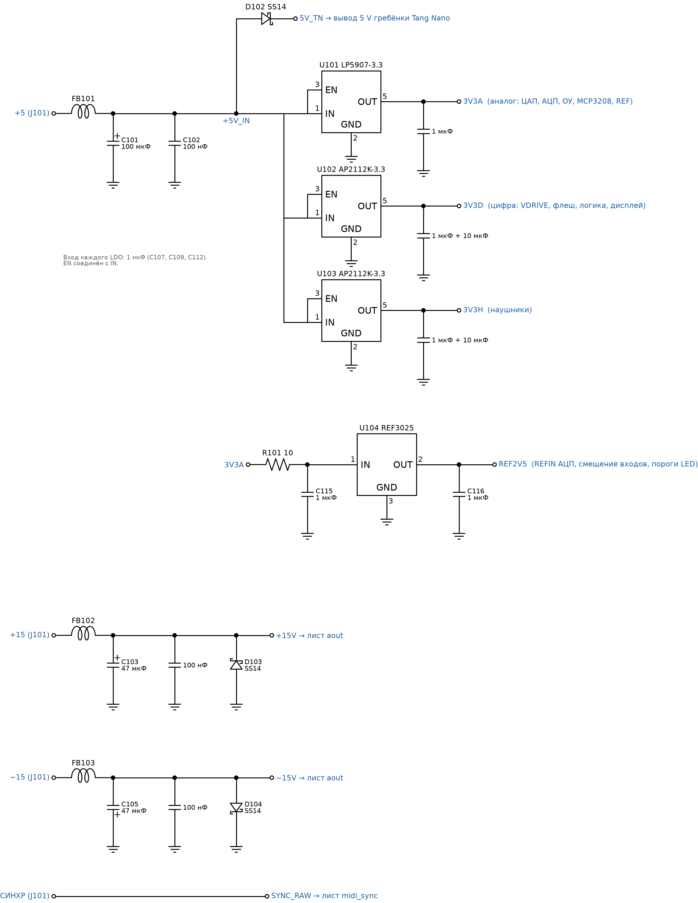
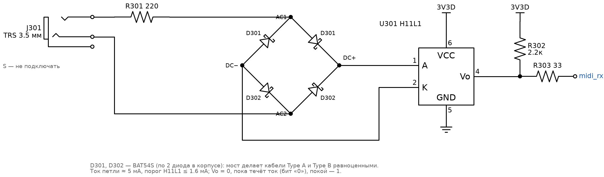
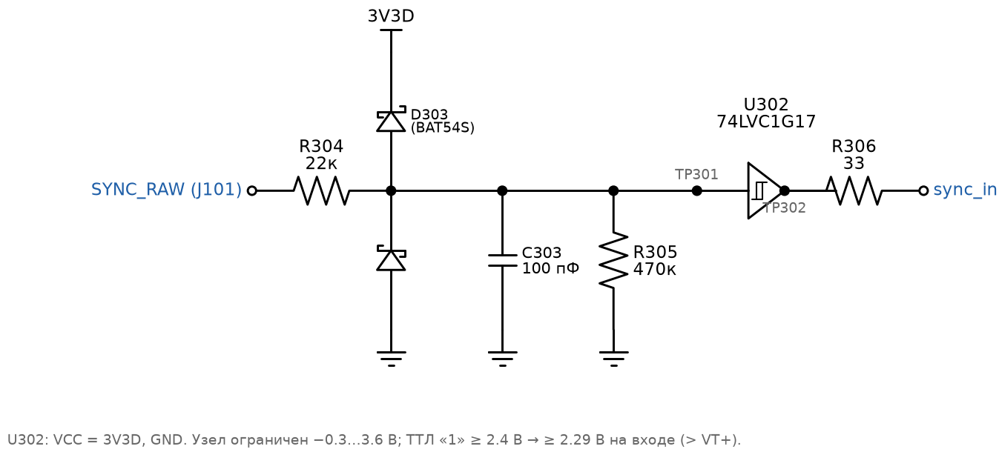
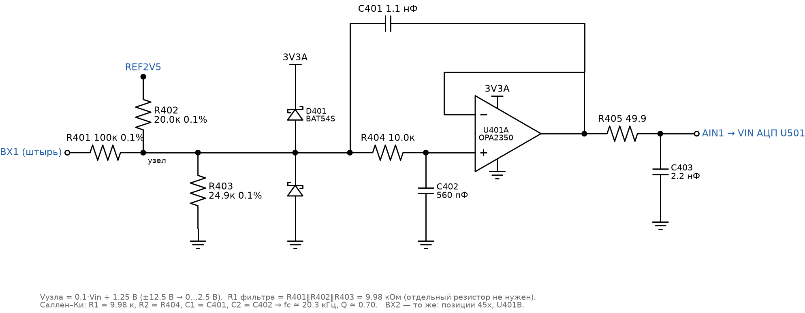
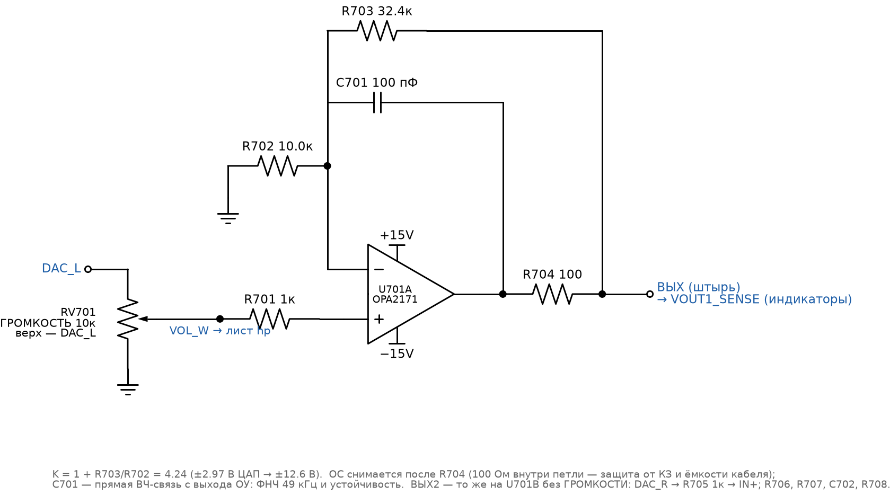
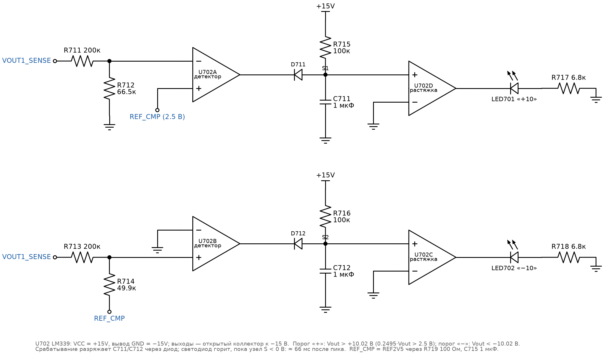

# Принципиальная схема несущей платы: описание по узлам

Статус: **черновик v0.1** — исходные данные для рисования схемы в KiCad.
Требования (`Т-xx`) и обоснования — [`hw-requirements.md`](../.plans/fpga-synth/hw-requirements.md);
структурная схема — [`block-diagram.svg`](../.plans/fpga-synth/block-diagram.svg); панель — [`panel-sketch.svg`](../.plans/fpga-synth/panel-sketch.svg).

Как читать:
- Картинки узлов — `hw/img/sch_*.png` (рядом SVG), генерируются `python3 hw/img/gen_schematics.py`
  (schemdraw + matplotlib); при изменении номиналов правится скрипт, а не картинка.
- Схема разбита на **иерархические листы KiCad** (раздел 0). У каждого листа — назначение, таблица элементов
  (позиционное обозначение, номинал, корпус, куда подключён), расчёт номиналов и замечания по разводке.
- **Имена цепей ПЛИС совпадают с портами** `fpga/boards/tang_nano_20k/top_synth.sv` (`i2s_bck`, `pot_cs_n`, …) —
  так проще сверять схему с `.cst`.
- **Номера выводов** указаны там, где цоколёвка стандартная (сдвоенный ОУ SOIC-8, LM339, MCP3208, SOT-23 и т. п.).
  Где написано «по даташиту» — цоколёвку брать из символа KiCad/даташита конкретной микросхемы и **обязательно сверить**.
- Резисторы 0603 1 %, если не сказано иное; «0.1 %» — прецизионные (тонкоплёночные, 25 ppm/°C). Конденсаторы до 1 нФ
  — C0G/NP0; 100 нФ…10 мкФ — X7R; электролиты — с запасом по напряжению ×1.5.

---

## 0. Листы и шины

| Лист | Поз. | Содержание | Шины питания |
|---|---|---|---|
| `power` | 1xx | нижний разъём, фильтры, Шоттки 5 В, LDO 3V3A / 3V3D / 3V3H, опора 2.5 В | вход: +5, +15, −15 |
| `fpga` | 2xx | гребёнки Tang Nano 20K, SPI-флеш прошивки, контрольные точки цифры | 5V_TN, 3V3D |
| `midi_sync` | 3xx | MIDI TRS → мост → оптрон; СИНХР → ограничитель → триггер Шмитта | 3V3D |
| `ain` (×2) | 4xx / 45x | входной каскад ВХ1 / ВХ2: сумматор-сдвиг, ограничитель, ФНЧ Саллена–Ки | 3V3A, REF2V5 |
| `adc` | 5xx | 2× AD7091R | 3V3A, 3V3D, REF2V5 |
| `dac` | 6xx | PCM5102A | 3V3A, 3V3D |
| `aout` | 7xx | ГРОМКОСТЬ, выходные ОУ ВЫХ/ВЫХ2, индикаторы перегрузки | ±15, REF2V5 |
| `hp` | 8xx | усилитель наушников, гнездо НАУШН./ЛИН. | 3V3H |
| `panel` | 9xx | 8 потенциометров + MCP3208, 4 энкодера, дисплей, панельные штыри | 3V3A, 3V3D |

**Шины (глобальные метки):**

| Цепь | Источник | Потребители |
|---|---|---|
| `+5V_IN` | нижний разъём, после фильтра | Шоттки → `5V_TN`, LDO 3V3A / 3V3D / 3V3H |
| `5V_TN` | D102 (Шоттки) | вывод 5 V Tang Nano |
| `+15V`, `−15V` | нижний разъём, после фильтров | OPA2171, LM339 |
| `3V3A` | U101 LP5907 | ОУ входов, АЦП (VDD), ЦАП (AVDD, CPVDD), MCP3208, потенциометры, REF |
| `3V3D` | U102 AP2112K | ЦАП (DVDD), АЦП (VDRIVE), флеш, оптрон, 74LVC1G17, энкодеры, дисплей |
| `3V3H` | U103 AP2112K | усилитель наушников |
| `REF2V5` | U104 REF3025 | REFIN обоих АЦП, смещение входов, пороги индикаторов |
| `GND` | нижний разъём | единая земля (Т-2.1) |

---

## 1. Лист `power`

| Поз. | Номинал / тип | Корпус | Подключение / примечание |
|---|---|---|---|
| J101 | разъём штатного модуля АВК-6 | по образцу | +5, +15, −15, GND, СИНХР; распиновка — HO-06 |
| FB101 | ферритовая бусина 600 Ом @100 МГц, ≥ 2 А | 0805 | +5 → `+5V_IN` |
| FB102, FB103 | ферритовая бусина 600 Ом @100 МГц, ≥ 0.5 А | 0603 | +15 → `+15V`, −15 → `−15V` |
| C101 | 100 мкФ / 10 В, электролит или полимер | SMD 6.3×5.4 | `+5V_IN` – GND |
| C103, C105 | 47 мкФ / 25 В, электролит | SMD 6.3×5.4 | `+15V` – GND, `−15V` – GND (минус к −15!) |
| C102, C104, C106 | 100 нФ | 0603 | рядом с электролитами |
| D102 | SS14 (1 А, 40 В) | SMA | анод `+5V_IN`, катод `5V_TN` (Т-2.2) |
| D103 | SS14 | SMA | катод `+15V`, анод GND (защита ОУ, Т-2.9) |
| D104 | SS14 | SMA | анод `−15V`, катод GND |
| U101 | LP5907MFX-3.3 (250 мА, 6.5 мкВ rms) | SOT-23-5 | 1 IN = `+5V_IN`, 2 GND, 3 EN = IN, 4 NC, 5 OUT = `3V3A` |
| C107, C108 | 1 мкФ X7R | 0603 | вход и выход U101 (керамика обязательна) |
| U102 | AP2112K-3.3 (600 мА) | SOT-23-5 | 1 VIN = `+5V_IN`, 2 GND, 3 EN = VIN, 4 NC, 5 VOUT = `3V3D` |
| C109, C110 | 1 мкФ + C111 10 мкФ | 0603 / 0805 | вход, выход U102; 10 мкФ — на выходе (дисплей, флеш) |
| U103 | AP2112K-3.3 | SOT-23-5 | как U102, VOUT = `3V3H` |
| C112, C113 | 1 мкФ + C114 10 мкФ | 0603 / 0805 | вход, выход U103 |
| R101 | 10 Ом | 0603 | `3V3A` → вход REF (RC-фильтр с C115) |
| C115 | 1 мкФ | 0603 | вход U104 – GND |
| U104 | REF3025 (2.5 В, 0.2 %, 50 ppm/°C) или REF3325 / ADR361 (лучше по дрейфу) | SOT-23-3 | REF3025: 1 IN, 2 OUT = `REF2V5`, 3 GND (сверить по даташиту выбранной опоры) |
| C116 | 1 мкФ X7R | 0603 | `REF2V5` – GND, у вывода OUT (проверить допустимую ёмкость нагрузки опоры) |
| TP101…TP107 | контрольные точки | — | `+5V_IN`, `+15V`, `−15V`, `3V3A`, `3V3D`, `3V3H`, `REF2V5`; TP108, TP109 — GND |

**Расчёт и замечания:**
- Потери на LDO: (5 − 3.3) В × ток. U102 (3V3D: дисплей ~30 мА, флеш, логика) — до 0.1 Вт; U103 (наушники) — до 0.15 Вт
  в пиках. SOT-23-5 справляется, но под выводом GND — полигон.
- REF2V5 нагружен: 2 × REFIN АЦП (единицы мкА), 2 × Rb 20 кОм (до ±0.1 мА в зависимости от входа), ветка индикаторов
  (≤ 0.1 мА) — итого < 0.5 мА, REF3025 отдаёт до 25 мА.
- Шины ±15 в схеме используются только в листе `aout`; −15 не заводить на другие листы.

## 2. Лист `fpga`

| Поз. | Номинал / тип | Корпус | Подключение / примечание |
|---|---|---|---|
| J201, J202 | гнёзда 1×20, шаг 2.54 (ответные к гребёнкам Tang Nano 20K) | THT | цоколёвка — по схеме Sipeed Tang Nano 20K (HO-01) |
| U201 | W25Q64JVSSIQ (64 Мбит SPI NOR) — прошивка CPU и калибровки | SOIC-8 | 1 /CS = `flash_cs_n`, 2 DO = `flash_miso`, 3 /WP = 3V3D, 4 GND, 5 DI = `flash_mosi`, 6 CLK = `flash_sck`, 7 /HOLD = 3V3D, 8 VCC = 3V3D |
| R201 | 10 кОм | 0603 | `flash_cs_n` → 3V3D (флеш не выбрана, пока ПЛИС не сконфигурирована) |
| C201 | 100 нФ | 0603 | VCC U201 |
| R202…R2xx | 33 Ом | 0603 | последовательно в **выходах ПЛИС с быстрыми фронтами**, у вывода ПЛИС: `i2s_bck`, `i2s_lrck`, `i2s_din`, `adc_sclk`, `pot_sck`, `lcd_sck`, `flash_sck` (гасят звон на линиях длиннее ~5 см) |
| TP2xx | контрольные точки | — | `i2s_bck`, `i2s_lrck`, `i2s_din`, `adc_sclk`, `adc_sdo1`, `midi_rx`, `sync_in` (Т-15.5) |

**Внешний флеш нужен**: на Tang Nano 20K встроенная SPI-флеш занята битстримом и недоступна пользовательской логике,
поэтому прошивка CPU (`FW_FLASH_OFFSET`) и калибровки (план, Ж0.3) лежат во внешней микросхеме на гребёнке
(`fpga/README.md`). На 9K используется встроенная флеш — U201 на макете не нужна.

**Назначение выводов ПЛИС** (номера — из текущего `tang_nano_20k_synth.cst`, предварительно; остальные — назначить при HO-01
и внести в единую таблицу пинов, план Ж0.1):

| Цепь | Направление | Вывод ПЛИС | Лист |
|---|---|---|---|
| `i2s_bck`, `i2s_lrck`, `i2s_din` | выход | 25, 26, 27 | dac |
| `dac_xsmt` | выход | 28 | dac, hp |
| `midi_rx` | вход | 29 | midi_sync |
| `uart_tx`, `uart_rx` | — | 69, 70 (BL702 на плате Tang Nano — **на несущую не выводить**) | — |
| `flash_sck`, `flash_mosi`, `flash_miso`, `flash_cs_n` | вых/вых/вх/вых | 73, 74, 75, 85 | fpga |
| `sync_in` | вход | HO-01 | midi_sync |
| `adc_convst_n`, `adc_cs_n`, `adc_sclk` | выход | HO-01 | adc |
| `adc_sdo1`, `adc_sdo2` | вход | HO-01 | adc |
| `pot_sck`, `pot_mosi`, `pot_cs_n` / `pot_miso` | выход / вход | HO-01 | panel |
| `enc_a[3:0]`, `enc_b[3:0]`, `enc_sw[3:0]` | вход | HO-01 | panel |
| `lcd_sck`, `lcd_mosi`, `lcd_cs_n`, `lcd_dc`, `lcd_rst_n`, `lcd_bl` | выход | HO-01 | panel |
| `sd_*` | — | слот TF на плате Tang Nano (на несущую не выводить) | — |

Итого на гребёнке: **37 GPIO** (33 по Т-3.4 + 4 на флеш). Если свободных меньше — объединить SCK/MOSI потенциометров,
дисплея и флеша в одну шину с раздельными CS (тогда RTL: общий SPI-мастер, план Ж0.1).

Питание Tang Nano: `5V_TN` → вывод 5 V гребёнки; GND — **все** выводы GND гребёнки на полигон. Вывод 3V3 Tang Nano
на несущей не использовать (у платы свой LDO, и 3V3D от него не зависит).

## 3. Лист `midi_sync`

### 3.1 MIDI (Т-4)

| Поз. | Номинал / тип | Корпус | Подключение / примечание |
|---|---|---|---|
| J301 | гнездо 3.5 мм стерео на панель (PJ-392 / Lumberg 1503 09) | THT | T, R, S; на панели слева (у входов) |
| R301 | 220 Ом | 0805 | T → AC1 моста |
| D301, D302 | BAT54S (два Шоттки последовательно; 1 — анод D1, 2 — катод D2, 3 — средняя точка) | SOT-23 | мост: вывод 3 D301 = AC1, вывод 3 D302 = AC2; выводы 2 обоих = DC+; выводы 1 обоих = DC− |
| U301 | H11L1 (оптрон с триггером Шмитта, VCC 3…15 В) | DIP-6 / SMD-6 | 1 анод = DC+, 2 катод = DC−, 4 Vo, 5 GND, 6 VCC = 3V3D (сверить цоколёвку по даташиту) |
| C302 | 100 нФ | 0603 | VCC U301 |
| R302 | 2.2 кОм | 0603 | Vo → 3V3D (выход — открытый коллектор) |
| R303 | 33 Ом | 0603 | Vo → `midi_rx` |
| C301 | 10 нФ / 100 В, **не устанавливать** | 0603 | S → GND, только если будут наводки; MIDI-приёмник по стандарту экран не заземляет |

**Расчёт:** ток петли от передатчика 5 В (220 + 220 Ом в передатчике + R301 220 Ом): (5 − 1.2 светодиод − 2·0.3 мост) / 660 ≈ 4.8 мА;
от передатчика 3.3 В (33 + 10 Ом): (3.3 − 1.8) / 263 ≈ 5.7 мА. Порог H11L1 ≤ 1.6 мА — запас ×3.
Полярность: ток течёт при «0» бита → Vo = 0; покой (нет тока) → Vo = 1 — это и ждёт `uart_rx` RTL (покой — высокий уровень).
Мост делает разницу между TRS Type A и Type B несущественной (Т-4.2).

### 3.2 СИНХР (Т-5)

| Поз. | Номинал / тип | Корпус | Подключение / примечание |
|---|---|---|---|
| R304 | 22 кОм | 0603 | `SYNC_RAW` → узел |
| D303 | BAT54S | SOT-23 | 1 = GND, 2 = 3V3D, 3 = узел (ограничение −0.3…+3.6 В) |
| C303 | 100 пФ | 0603 | узел → GND (τ = 2.2 мкс — фильтр иголок, на 1.1 кГц не влияет) |
| R305 | 470 кОм | 0603 | узел → GND: определённый «0», когда АВК выключен или СИНХР не подан |
| U302 | 74LVC1G17 (буфер с триггером Шмитта) | SOT-23-5 | 1 NC, 2 A = узел, 3 GND, 4 Y, 5 VCC = 3V3D |
| C304 | 100 нФ | 0603 | VCC U302 |
| R306 | 33 Ом | 0603 | Y → `sync_in` |

**Расчёт:** ТТЛ «1» ≥ 2.4 В → узел 2.4 · 470 / 492 = 2.29 В > порога VT+ 74LVC1G17 при 3.3 В (≤ 2.0 В) — уверенная «1».
При +15 В ток через ограничитель (15 − 3.6) / 22 к ≈ 0.52 мА — поглощает нагрузка 3V3D; при −15 В ≈ 0.67 мА в GND.
**Поправка к Т-5.3:** порог — порог 74LVC1G17 при 3.3 В (VT+ ≈ 1.5…2.0 В, VT− ≈ 0.9…1.4 В), а не «~1.4 В»; для ТТЛ и ±10 В годится.

## 4. Лист `ain` (повторяется для ВХ1 и ВХ2)

| Поз. (ВХ1 / ВХ2) | Номинал / тип | Корпус | Подключение / примечание |
|---|---|---|---|
| R401 / R451 | 100 кОм 0.1 % | 0805 | панельный штырь ВХ → узел сумматора (Ra) |
| R402 / R452 | 20.0 кОм 0.1 % | 0603 | `REF2V5` → узел (Rb) |
| R403 / R453 | 24.9 кОм 0.1 % | 0603 | узел → GND (Rc) |
| D401 / D451 | BAT54S | SOT-23 | 1 = GND, 2 = 3V3A, 3 = узел |
| C401 / C451 | 1.1 нФ C0G 1 % (или 1 нФ + 100 пФ) | 0603 | узел → выход ОУ (C1 фильтра Саллена–Ки) |
| R404 / R454 | 10.0 кОм 0.1 % | 0603 | узел → вход + ОУ (R2 фильтра) |
| C402 / C452 | 560 пФ C0G 1 % | 0603 | вход + ОУ → GND (C2 фильтра) |
| U401 | OPA2350 / TLV9062 / OPA2365 — **одна сдвоенная на оба канала**: A — ВХ1, B — ВХ2 | SOIC-8 | 1 OUTA, 2 IN−A = 1, 3 IN+A; 4 V− = GND; 5 IN+B, 6 IN−B = 7, 7 OUTB; 8 V+ = 3V3A |
| C404 | 100 нФ | 0603 | V+ U401 |
| R405 / R455 | 49.9 Ом | 0603 | выход ОУ → `AIN1` / `AIN2` |
| C403 / C453 | 2.2 нФ C0G | 0603 | `AIN1` / `AIN2` → GND, у вывода VIN АЦП |
| TP401 / TP451 | контрольная точка | — | `AIN1` / `AIN2` (Т-15.5) |

**Расчёт:**
- Сумматор: 1/Ra : 1/Rb : 1/Rc = 1 : 5 : 4.02 → Vузла = 0.1·Vin + 0.5·REF = 0.1·Vin + 1.25 В. ±12.5 В → 0…2.5 В.
  Выходное сопротивление узла (Тевенен) R1 = Ra‖Rb‖Rc = 9.98 кОм — это **первый резистор фильтра**, отдельный не нужен.
  Rвх по ВХ ≈ Ra + Rb‖Rc = 111 кОм (Т-6.2).
- Фильтр Саллена–Ки, единичное усиление, R1 = 9.98 к, R2 = 10.0 к, C1 = 1.1 нФ, C2 = 560 пФ:
  fc = 1 / (2π·√(R1·R2·C1·C2)) ≈ 20.3 кГц; Q = √(R1·R2·C1·C2) / (C2·(R1 + R2)) ≈ 0.70 (Баттерворт).
  На 172 кГц: −40·lg(172/20.3) ≈ −37 дБ (Т-6.3).
- Перегрузка: при +15 В узел = 2.75 В (< 3.3 В, ограничитель молчит), при −15 В узел = −0.25 В — открывается D401,
  ток ≤ 0.15 мА. ОУ с однополярным питанием 3V3A сам не выведет АЦП за 0…3.3 В.
- RC 49.9 Ом / 2.2 нФ (fc ≈ 1.45 МГц) — «резервуар» для заряда УВХ АЦП; ОУ видит его через 49.9 Ом и остаётся устойчивым.
- Погрешность: 0.1 % резисторов → ≤ 0.2 % усиления и ≤ 3 мВ смещения (приведено ко входу ≤ 30 мВ) до калибровки (Т-6.4).

**Разводка:** R401 у штыря, остальное — компактно у АЦП; узел сумматора (высокоомный) — короткий, окружить GND,
цифровые линии рядом не вести. Каналы ВХ1 и ВХ2 развести симметрично (Т-6.6).

## 5. Лист `adc`

| Поз. | Номинал / тип | Корпус | Подключение / примечание |
|---|---|---|---|
| U501, U502 | AD7091R (12 бит, 1 MSPS, SPI) — U501 для ВХ1, U502 для ВХ2 | MSOP-10 | выводы — **по даташиту**; цепи ниже |
| — VIN | | | U501: `AIN1`; U502: `AIN2` |
| — VDD | | | 3V3A, у каждой 100 нФ + 1 мкФ (C501…C504) |
| — VDRIVE | | | 3V3D, 100 нФ (C505, C506) — логика 3.3 В (Т-7.4) |
| — REFIN/REFOUT | | | `REFIN_ADC` (см. ниже), 1 мкФ X7R на GND у каждого (C507, C508; номинал — по даташиту) |
| — REGCAP (если есть) | | | конденсатор внутреннего регулятора — по даташиту |
| — GND | | | GND |
| — CONVST | | | `adc_convst_n` — **общий** для обоих (одновременная выборка, Т-7.1) |
| — CS | | | `adc_cs_n` — общий |
| — SCLK | | | `adc_sclk` — общий (через 33 Ом у ПЛИС, лист fpga); развести «звездой» от ПЛИС или цепочкой с минимальным отводом |
| — SDO | | | U501 → `adc_sdo1`, U502 → `adc_sdo2` (раздельные линии; общий CS не мешает) |
| R501 | 0 Ом (перемычка, выбор опоры) | 0603 | `REF2V5` → `REFIN_ADC` |

**Опора (HO-09).** По требованию Т-7.3 оба АЦП работают от общей внешней 2.5 В (`REF2V5`), той же, что даёт смещение
входов, — тогда смещение и шкала уходят вместе и сокращаются. **Нужно подтвердить по даташиту AD7091R**, как отключается
внутренняя опора при подаче внешней на REFIN/REFOUT (вывод, команда или режим питания). Запасной вариант без внешней опоры:
R501 не ставить, `REF2V5` брать с REFOUT U501 через повторитель на свободном ОУ (буфер обязателен — REFOUT высокоомный),
U104 не устанавливать.

**Разводка:** АЦП — между входными каскадами и ПЛИС; аналоговая и цифровая стороны микросхемы ориентированы к своим зонам;
полигон GND сплошной, без разреза.

## 6. Лист `dac`

| Поз. | Номинал / тип | Корпус | Подключение / примечание |
|---|---|---|---|
| U601 | PCM5102A | TSSOP-20 | цоколёвка ниже — **сверить с даташитом** |
| вывод 1 CPVDD | | | 3V3A; C601 100 нФ + C602 10 мкФ |
| 2 CAPP — 4 CAPM | | | C603 2.2 мкФ X7R между CAPP и CAPM (летающий конденсатор накачки) |
| 3 CPGND | | | GND |
| 5 VNEG | | | C604 2.2 мкФ X7R → GND |
| 6 OUTL | | | → R601 470 Ом → `DAC_L`; C605 2.2 нФ C0G `DAC_L` → GND |
| 7 OUTR | | | → R602 470 Ом → `DAC_R`; C606 2.2 нФ C0G `DAC_R` → GND |
| 8 AVDD | | | 3V3A; C607 100 нФ + C608 10 мкФ |
| 9 AGND | | | GND |
| 10 DEMP | | | GND (без де-эмфазиса) |
| 11 FLT | | | 3V3D (фильтр low latency, Т-8.2) |
| 12 SCK | | | GND (тактирование PLL от BCK, Т-8.1) |
| 13 BCK, 14 DIN, 15 LRCK | | | `i2s_bck`, `i2s_din`, `i2s_lrck` |
| 16 FMT | | | GND (I2S) |
| 17 XSMT | | | `dac_xsmt` через R603 1 кОм; R604 10 кОм → GND (молчит, пока ПЛИС не сконфигурирована, Т-8.3) |
| 18 LDOO | | | C609 1 мкФ X7R → GND (выход внутреннего LDO, наружу не нагружать) |
| 19 DGND | | | GND |
| 20 DVDD | | | 3V3D; C610 100 нФ + C611 10 мкФ |
| TP601, TP602 | | | `DAC_L`, `DAC_R` |

**Расчёт:** RC 470 Ом / 2.2 нФ (fc ≈ 154 кГц) — рекомендованный даташитом фильтр внеполосного шума.
Нагрузка на `DAC_L`: ГРОМКОСТЬ 10 к ‖ делитель наушников 20 к ≈ 6.7 кОм — 470 Ом дают −6.6 % шкалы на ВЫХ при громкости
на максимуме; на `DAC_R` (нагрузка ~1 МОм входа ОУ) — 0 %. Это **убирается программной калибровкой выходов** (план Ж0.3):
требование «×1 в крайнем положении» (Т-9.2) выполняется для всей цепочки после калибровки. Если нужна точность без
калибровки — R601 = 100 Ом, C605 = 10 нФ (та же fc, −1.5 %).

**Разводка:** конденсаторы накачки (C603, C604) и LDOO — вплотную к выводам; I2S от ПЛИС — короткие, с GND рядом.

## 7. Лист `aout`

### 7.1 Выходные усилители ВЫХ, ВЫХ2 (Т-9)

| Поз. | Номинал / тип | Корпус | Подключение / примечание |
|---|---|---|---|
| RV701 | 10 кОм, логарифмический (A) или линейный (HO-04), на плату, вал с резьбовой втулкой; Ø ручки — крупная | 9 / 16 мм | 1 (низ) = GND, 3 (верх) = `DAC_L`, 2 (движок) = `VOL_W` |
| R701 | 1 кОм | 0603 | `VOL_W` → IN+ U701A (защита входа, развязка от ёмкости) |
| U701 | OPA2171 (±18 В, RRO, малый входной ток) | SOIC-8 | 1 OUTA, 2 IN−A, 3 IN+A, 4 V− = −15V, 5 IN+B, 6 IN−B, 7 OUTB, 8 V+ = +15V |
| C703, C704 | 100 нФ | 0603 | V+ и V− U701, у выводов; C705, C706 10 мкФ / 25 В на группу |
| R702 / R706 | 10.0 кОм 0.1 % | 0603 | IN− → GND (Rg) |
| R703 / R707 | 32.4 кОм 0.1 % | 0603 | **ВЫХ / ВЫХ2 (после R704 / R708)** → IN− (Rf: ОС с нагрузки, Т-9.5) |
| C701 / C702 | 100 пФ C0G | 0603 | **OUT ОУ** → IN− (ВЧ-обратная связь мимо R704 — устойчивость на ёмкость кабеля + ФНЧ) |
| R704 / R708 | 100 Ом | 0805 | OUT ОУ → штырь ВЫХ / ВЫХ2 (защита от КЗ и ёмкости, внутри петли ОС) |
| R705 | 1 кОм | 0603 | `DAC_R` → IN+ U701B |
| TP701, TP702 | | | ВЫХ, ВЫХ2 |

**Расчёт:** K = 1 + 32.4/10.0 = 4.24 → полная шкала ЦАП ±2.97 В → ±12.6 В; МЕ ±10 В при 0.79 FS (Т-9.1).
ФНЧ: 1/(2π·32.4 к·100 пФ) ≈ 49 кГц (Т-9.6). Выходное сопротивление на НЧ ≈ 100 Ом / (петлевое усиление) < 0.1 Ом (Т-9.5).
КЗ на GND: ток ограничен ОУ (~±35 мА у OPA2171) и 100 Ом; рассеяние в SOIC-8 ≈ 0.5 Вт на канал в худшем случае —
кратковременно допустимо; длительное КЗ обоих каналов — проверить нагрев на макете (Ж2.12).

### 7.2 Индикаторы перегрузки +10 / −10 (Т-10)

Все четыре компаратора LM339 питаются от +15 / −15 (вывод 3 VCC = +15V, вывод 12 GND = **−15V**): тогда входной диапазон
−15…+13.5 В охватывает и ±10 В, и 0 В, а открытый коллектор тянет выход к −15 В.

| Поз. | Номинал / тип | Корпус | Подключение / примечание |
|---|---|---|---|
| U702 | LM339 (4 компаратора, открытый коллектор) | SOIC-14 | 1 OUT2, 2 OUT1, 3 VCC = +15V, 4 IN1−, 5 IN1+, 6 IN2−, 7 IN2+, 8 IN3−, 9 IN3+, 10 IN4−, 11 IN4+, 12 GND = −15V, 13 OUT4, 14 OUT3 |
| C713, C714 | 100 нФ | 0603 | VCC и «GND» (−15V) U702 |
| R711 / R712 | 200 кОм / 66.5 кОм | 0603 | делитель ВЫХ → IN1− (порог +10.02 В) |
| R713 / R714 | 200 кОм / 49.9 кОм | 0603 | сумматор ВЫХ и `REF_CMP` → IN2+ (порог −10.02 В) |
| R719, C715 | 100 Ом, 1 мкФ | 0603 | `REF2V5` → `REF_CMP` (развязка опоры АЦП от бросков компараторов; 100 Ом последовательно с R714 сдвигают порог «−» всего на 0.02 В — больше не ставить) |
| D711, D712 | 1N4148W | SOD-123 | анод — узел S1/S2, катод — OUT1/OUT2 |
| R715, R716 | 100 кОм | 0603 | S1/S2 → +15V |
| C711, C712 | 1 мкФ X7R / 25 В | 0805 | S1/S2 → GND |
| LED701, LED702 | красный 3 мм повышенной яркости (на панель, Т-10) | THT | катод → OUT4 / OUT3, анод → R717 / R718 |
| R717, R718 | 6.8 кОм | 0603 | анод LED → GND |

**Как работает:**
- Детектор «+»: 0.2495·Vout > 2.5 В (Vout > +10.02 В) → IN1− > IN1+ → OUT1 открыт (−15 В) → через D711 быстро
  разряжает C711 до ≈ −14 В.
- Детектор «−»: (Vout/200к + 2.5/49.9к) < 0 (Vout < −10.02 В) → IN2+ < IN2− → OUT2 открыт → разряжает C712.
- Растяжка: пока S < 0 В, IN+ < IN− → OUT открыт → светодиод горит, ток (15 − 1.8) / 6.8 к ≈ 1.9 мА.
  После превышения S заряжается через 100 к к +15 В; от −14 В до 0 В — τ·ln(29/15) ≈ 66 мс (Т-10.2: ≥ 50 мс).
- Нагрузка на ВЫХ: 266.5 к ‖ 249.9 к ≈ 129 кОм (Т-10.3: ≥ 100 кОм). Порог ±10.02 В ±0.25 В при 0.1 % делителях и 0.2 % опоре.

## 8. Лист `hp` — наушники / линейный (Т-9a)

| Поз. | Номинал / тип | Корпус | Подключение / примечание |
|---|---|---|---|
| R801, R802 | 10 кОм / 10 кОм | 0603 | `VOL_W` → R801 → узел HP_IN → R802 → GND (×0.5) |
| C801, C802 | 1 мкФ (плёнка PPS / X7R 16 В) | 0805 | HP_IN → INL, HP_IN → INR (у каждого входа свой) |
| U801 | TPA6132A2 (усилитель наушников DirectPath) | QFN-16 3×3 (WQFN) | выводы — **по даташиту**: INL, INR, OUTL, OUTR, EN, G0, G1, питание и накачка |
| — питание (VDD / HPVDD) | | | `3V3H`; 100 нФ + 2.2 мкФ у выводов (по даташиту) |
| — накачка (CPP/CPN, HPVSS/VSS) | | | конденсаторы 1 мкФ X7R — номиналы и места по даташиту |
| — G0, G1 | | | на GND / 3V3H через 0 Ом-перемычки — коэффициент 0 дБ по таблице даташита (вариант +6 дБ — перестановкой перемычек) |
| — EN | | | `HP_EN`: `dac_xsmt` → R803 10 кОм → EN; C803 1 мкФ → GND (включение ≈ 10 мс после ЦАП, Т-9a.7) |
| — OUTL / OUTR | | | → J801 Tip / Ring напрямую (каждый наушник — свой канал, Т-9a.5) |
| J801 | гнездо 3.5 мм стерео на панель | THT | T = OUTL, R = OUTR, S = GND; на панели справа (у выходов) |
| D801 | ESD-диоды на T и R (например, PESD5V0S2BT / TPD2E001) | SOT-23 | T, R → GND |
| TP801 | | | HP_IN |

**Расчёт:** полная шкала ЦАП на `VOL_W` 2.1 В rms → ×0.5 → ≈ 1.05 В rms на входе → при 0 дБ ≈ 1 В rms на выходе
(линейный уровень; на 32 Ом ≈ 31 мВт — ограничение самой микросхемы, Т-9a.3). Нижняя граница — от 1 мкФ и входного
сопротивления TPA6132A2 (единицы–десятки кОм по выбранному усилению): ≤ 5 Гц проверить по даташиту, при необходимости
C801/C802 → 2.2 мкФ. Делитель 20 кОм нагружает движок громкости; учтено в листе `dac`.

**Альтернатива под ручную пайку** (если QFN неудобен): NJM4556A (SOIC-8) от ±9 В (78L09 / 79L09 от ±15 В),
канал A → Tip, B → Ring, по 10 Ом в выходе, вход 1 мкФ + 100 кОм на GND, усиление ×1 (повторитель). Защита от
длительного КЗ хуже (Т-9a.6) — оставить посадочное место только если TPA6132A2 недоступен.

## 9. Лист `panel`

### 9.1 Потенциометры и MCP3208 (Т-11)

| Поз. | Номинал / тип | Корпус | Подключение / примечание |
|---|---|---|---|
| RV901…RV908 | B10K, 9 мм, вертикальный, на плату, вал с резьбовой втулкой | THT | 1 = GND, 3 = `3V3A` (VREF), 2 → R90x; порядок: RV901 СРЕЗ, RV902 РЕЗОН., RV903 ENV→Ф, RV904 FX MIX, RV905 A, RV906 D, RV907 S, RV908 R |
| R901…R908 | 1 кОм | 0603 | движок → CHx |
| C901…C908 | 100 нФ | 0603 | CHx → GND, у MCP3208 |
| U901 | MCP3208 | SOIC-16 | 1…8 CH0…CH7 (= RV901…RV908), 9 DGND, 10 CS/SHDN = `pot_cs_n`, 11 DIN = `pot_mosi`, 12 DOUT = `pot_miso`, 13 CLK = `pot_sck`, 14 AGND, 15 VREF, 16 VDD |
| — VDD, VREF | | | `3V3A`; C909 100 нФ + C910 1 мкФ у VDD; VREF — от той же `3V3A` через R909 10 Ом + C911 1 мкФ (общая точка с верхними выводами потенциометров → ратиометрия, Т-11.2) |
| R910 | 10 кОм | 0603 | `pot_cs_n` → 3V3D (АЦП выключен до конфигурации ПЛИС) |

Порядок каналов CH0…CH7 = порядок ручек в прошивке (`panel` в консоли, план Ж2.6) — при ином порядке разводки
поправить таблицу в прошивке, а не схему.

### 9.2 Энкодеры (Т-12) — на каждый из 4 (n = 0…3)

| Поз. | Номинал / тип | Корпус | Подключение / примечание |
|---|---|---|---|
| SW90n | EC11 с кнопкой (вал 20 мм, 20–30 щелчков) | THT | C (общий) = GND; A, B, кнопка (второй вывод кнопки — GND) |
| R92n, R93n, R94n | 10 кОм | 0603 | подтяжки A, B, кнопки → 3V3D (у энкодера) |
| R95n, R96n, R97n | 10 кОм | 0603 | A → `enc_a[n]`, B → `enc_b[n]`, кнопка → `enc_sw[n]` |
| C92n, C93n, C94n | 10 нФ | 0603 | `enc_a/b/sw[n]` → GND (у ПЛИС; τ = 100 мкс) |

SW900 = МЕНЮ (`enc_*[0]`), SW901 = ПАР.1, SW902 = ПАР.2, SW903 = ПАР.3. Активный уровень — низкий (как ждёт RTL).

### 9.3 Дисплей (Т-13)

| Поз. | Номинал / тип | Корпус | Подключение / примечание |
|---|---|---|---|
| J901 | гнездо 1×8, 2.54 (или FPC — по выбранному модулю) | THT | 1 GND, 2 VCC = 3V3D, 3 SCL = `lcd_sck`, 4 SDA = `lcd_mosi`, 5 RES = `lcd_rst_n`, 6 DC = `lcd_dc`, 7 CS = `lcd_cs_n`, 8 BLK (порядок выводов — **по модулю**) |
| C912 | 10 мкФ + 100 нФ | 0805 / 0603 | VCC дисплея |
| R911 | 100 Ом | 0603 | `lcd_bl` → BLK (вариант 1: у модуля свой ключ подсветки, вход BLK — логический) |
| Q901, R912, R913 | AO3400 (SOT-23: 1 G, 2 S, 3 D), 100 Ом в затвор, 100 кОм затвор → GND — **не устанавливать в варианте 1** | SOT-23 | вариант 2 (BLK — прямо анод подсветки, ~20 мА): BLK → 3V3D через токовый резистор модуля, катод подсветки → D Q901, S → GND, G ← `lcd_bl` |

Какой вариант — по конкретному модулю (Т-13.2): у большинства модулей ST7789 1.14″ вход BLK логический (вариант 1).

### 9.4 Панельные штыри

| Поз. | Тип | Подключение |
|---|---|---|
| J911…J914 | контактные площадки / гнездо 1×1 под провод к штырю 2РМТ | J911 = ВХ1 → R401, J912 = ВХ2 → R451, J913 = ВЫХ ← R704, J914 = ВЫХ2 ← R708 |

Земля на панель не выводится (Т-14.2).

## 10. Сводная таблица цепей ПЛИС ↔ листы

| Цепь RTL | Лист / элемент | Подтяжка / защита |
|---|---|---|
| `midi_rx` | U301 Vo | R302 2.2 к к 3V3D, R303 33 Ом |
| `sync_in` | U302 Y | R306 33 Ом |
| `adc_convst_n`, `adc_cs_n`, `adc_sclk` | U501, U502 | 33 Ом на SCLK у ПЛИС |
| `adc_sdo1`, `adc_sdo2` | U501, U502 SDO | — |
| `i2s_bck`, `i2s_lrck`, `i2s_din` | U601 | 33 Ом у ПЛИС |
| `dac_xsmt` | U601 XSMT (R603/R604), U801 EN (R803/C803) | R604 10 к к GND |
| `pot_sck`, `pot_mosi`, `pot_miso`, `pot_cs_n` | U901 | R910 10 к к 3V3D на CS; 33 Ом на SCK |
| `enc_a/b/sw[3:0]` | SW900…SW903 | 10 к к 3V3D + 10 к / 10 нФ |
| `lcd_*` | J901 | 33 Ом на SCK |
| `flash_*` | U201 | R201 10 к к 3V3D на CS; 33 Ом на SCK |

## 11. Что проверить по даташитам при рисовании

| # | Что | Где |
|---|---|---|
| 1 | Цоколёвка и отключение внутренней опоры AD7091R при внешней на REFIN (HO-09), номинал конденсатора на REFIN/REFOUT и REGCAP | лист `adc` |
| 2 | Цоколёвка PCM5102A (TSSOP-20), номиналы накачки и LDOO | лист `dac` |
| 3 | TPA6132A2: выводы, G0/G1 для 0 дБ, полярность и пороги EN, входное сопротивление (нижняя граница), конденсаторы накачки | лист `hp` |
| 4 | Цоколёвка H11L1 (DIP-6 / SMD) | лист `midi_sync` |
| 5 | Распиновка гребёнок Tang Nano 20K: 5 V, GND, свободные GPIO в банках 3.3 В (HO-01) | лист `fpga` |
| 6 | Распиновка нижнего разъёма АВК-6 (HO-06) | лист `power` |
| 7 | Модуль дисплея: порядок выводов и тип входа BLK | лист `panel` |
| 8 | Допустимая ёмкость на выходе выбранной опоры 2.5 В | лист `power` |

## 12. Перечень элементов (сводно)

| Тип | Поз. | Кол-во |
|---|---|---|
| ЦАП PCM5102A | U601 | 1 |
| АЦП AD7091R | U501, U502 | 2 |
| АЦП MCP3208 | U901 | 1 |
| ОУ OPA2350 / TLV9062 (3.3 В) | U401 | 1 |
| ОУ OPA2171 (±15 В) | U701 | 1 |
| Компаратор LM339 | U702 | 1 |
| Усилитель наушников TPA6132A2 | U801 | 1 |
| Оптрон H11L1 | U301 | 1 |
| 74LVC1G17 | U302 | 1 |
| SPI NOR W25Q64JV | U201 | 1 |
| LP5907-3.3 / AP2112K-3.3 | U101 / U102, U103 | 1 / 2 |
| Опора REF3025 (или REF3325 / ADR361) | U104 | 1 |
| SS14 | D102…D104 | 3 |
| BAT54S | D301…D303, D401, D451 | 5 |
| 1N4148W | D711, D712 | 2 |
| ESD для наушников | D801 | 1 |
| AO3400 (опционально) | Q901 | 0–1 |
| Ферритовые бусины | FB101…FB103 | 3 |
| Потенциометры B10K 9 мм / ГРОМКОСТЬ 10 к | RV901…RV908 / RV701 | 8 / 1 |
| Энкодеры EC11 с кнопкой | SW900…SW903 | 4 |
| Светодиоды 3 мм красные | LED701, LED702 | 2 |
| Гнёзда 3.5 мм TRS на панель | J301, J801 | 2 |
| Гнёзда 1×20 под Tang Nano | J201, J202 | 2 |
| Гнездо дисплея 1×8 | J901 | 1 |
| Нижний разъём АВК | J101 | 1 |
| Резисторы 0.1 % | R401–R404, R451–R454, R702, R703, R706, R707, (R711–R714 — 0.1 % желательно) | 12 (+4) |
